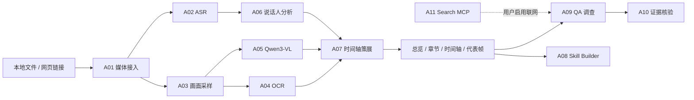

# LetsGoVideoAgent

> Evidence-first multi-agent system for general video understanding.

LetsGoVideoAgent 是一个面向通用视频内容的多模态、多 Agent 理解系统。它将视频下载、语音识别、画面采样、OCR、视觉语言模型、说话人分析、层级分段、证据问答、联网核验、成本追踪和垂类 Skill 生成组织成可观察、可约束、可评测的完整工作流。

项目当前处于 **v1.0 基线完成、v1.1 规划与开发阶段**。v1.0 已打通通用视频理解和 Skill Studio 基础闭环；v1.1 将重点验证垂类 Skill 是否真正提升新视频理解质量，并加入基于 Skill 的视频脚本生成与评估。

## 为什么做这个项目

普通的视频总结工具通常只对 ASR 文本做一次摘要，很难回答“这一帧展示了什么”“这个结论在哪一段出现”“画面和口播是否表达同一件事”。LetsGoVideoAgent 的重点是让结果回到可核验的时空证据：

- 同时理解语音、字幕、OCR、画面语义和时间关系；
- 自动形成大节、小节、代表帧和多轨时间轴；
- 支持全片、片段、某一刻和当前帧四种问答范围；
- 回答携带时间戳、截图、字幕或网页来源，而不只输出一段流畅文字；
- 将 Agent、模型、工具、MCP、预算、成本和失败状态统一纳入 Trace；
- 从多条同类视频中归纳可版本化 Skill，让领域能力与通用 Prompt 解耦。

## 系统截图

以下示例均使用 Zc 故事视频和对应垂类项目。

### 通用视频理解工作台

视频预览、处理进度、视频 Agent 对话与多轨时间轴保持在同一工作区。示例中音频、OCR 与 Qwen3-VL 视觉理解正在并行处理《【Zc故事】坚脚不移》。


### Agent 运行观测

每个 Agent 使用统一编号，展示当前职责、所处理视频、进度、模型/算法、等待关系和 Trace。图中 A05 视觉理解正在运行，已完成的媒体接入、ASR、抽帧和 OCR 不会被伪装成 LLM Agent。


### Skill Studio

垂类项目可以批量管理同类视频样本，查看每条视频的摘要、章节和代表画面，再选择样本生成、修改、发布和绑定 Skill；模型与 Agent 成本可追溯到具体视频和任务。


## 已实现能力（v1.0）

### 视频接入与本地媒体库

- 上传 MP4、MOV、MKV、WebM 等本地视频；
- 使用 `yt-dlp` 导入 B 站等受支持网页视频；
- 保存来源、标题、时长、分辨率、哈希和下载进度；
- 媒体统一进入 `videos/library/`，启动后递归扫描和幂等登记，避免重复下载；
- 导入、下载、探测和理解阶段均提供进度、失败原因与有限重试。

### 多模态感知与视频理解

- Faster-Whisper 本地 ASR，生成带时间戳字幕；
- RapidOCR 提取画面文字，并用 OpenCC 统一简体中文；
- PyAV/FFmpeg 按时间精确抽帧、采样和生成截图；
- SiliconFlow Qwen3-VL 理解人物、动作、UI、空间关系和画面意义；
- DeepSeek 融合语音、OCR 与视觉事实，生成总览、层级章节和片段摘要；
- 结合音频特征、对话逻辑和 OCR 称呼进行说话人分析；
- 使用语义覆盖、变化程度和去重策略选择代表帧。

### Evidence-first 视频问答

- 支持 `global`、`range`、`moment`、`frame` 四种问题目标；
- 当前帧问题按整数毫秒重新抽取真实帧，避免播放器画面与 VLM 输入错位；
- QA Investigator 调查证据，Evidence Verifier 独立检查时间范围和引用；
- 可显式启用联网补充；启用后必须实际调用 Search MCP；
- 视频内部证据与网页来源分开展示，证据不足时允许部分回答或拒答。

### Multi-Agent、Harness 与可观测性

- A00–A12 统一 Agent 注册表，覆盖接入、听觉、视觉、OCR、VLM、说话人、时间轴、Skill、问答、核验、搜索和恢复；
- 视频处理采用并行 DAG：音频与视觉分支并行，OCR 与 VLM 并行，最后汇合到语义策展；
- 问答使用 LangGraph 实现有界 Agentic RAG：调查 → 核验 → 必要时补查一次；
- 自研 Agent Harness 提供强类型工具、白名单、超时、步骤/工具/模型次数、Token/费用预算和循环保护；
- Trace 只记录公开执行摘要，不保存隐藏思维链、完整系统 Prompt、密钥或原始视频；
- 运行观测展示 Agent 状态、Harness、模型路由、MCP、成本和停止原因。

> 当前并不是无限自主循环的经典 ReAct。固定媒体处理继续采用确定性 DAG；v1.1 只计划在复杂开放性问题中评估受控 ReAct 子图，并以效果、成本和延迟决定是否启用。

### 垂类 Skill Studio

- 创建长期垂类项目并批量加入同类视频；
- 并行处理样本并查看每条视频的摘要、章节和代表画面；
- 从 1–8 条样本归纳内容内核、画面表达、文案口播、叙事节奏、术语、视觉关注点和输出模板；
- “生成新草案”创建独立 Skill v1，“继续修改”在同一 Skill 内产生 v2/v3；
- 人工发布后才写入 `skills/generated/<slug>/vN/SKILL.md`；
- 支持绑定视频、回滚、单个/批量删除和版本追踪；
- Skill 权限只能与 Harness 权限取交集，不能注册任意 Shell、文件写入或通用网络工具。

## Agent 工作流



Agent 不等于一次 LLM 调用。媒体下载、ASR、抽帧、OCR、去重和证据边界验证主要由工具或算法完成；DeepSeek 与 Qwen3-VL 只用于需要语言或视觉语义推理的节点。

## 模型和组件分工

| 类型 | 当前实现 | 主要职责 |
| --- | --- | --- |
| 文本 LLM | DeepSeek OpenAI-compatible API | 摘要、章节、字幕/术语审校、问答组织和 Skill 归纳 |
| 视觉语言模型 | SiliconFlow `Qwen/Qwen3-VL-32B-Instruct` | 代表帧语义、人物/动作/UI 理解和当前帧问答 |
| 本地视觉降级 | Ollama `qwen3-vl:4b` 适配器 | 可选离线视觉能力，不保证默认启用 |
| ASR | Faster-Whisper CPU int8 | 本地语音转写与时间戳 |
| OCR | RapidOCR + ONNX Runtime | 本地画面文字提取 |
| 搜索 | SearXNG + Python MCP SDK | 免费网页检索和专业术语核验 |
| Agent Framework | LangGraph 1.x | QA 状态图、条件路由和有限补救 |
| Agent Harness | 项目自研 | 权限、预算、结构化 I/O、Trace、超时和循环保护 |

模型通过应用端口与适配器接入，可更换兼容供应商。未配置真实 API 时可以使用 Mock 组件进行接口、工作流和前端开发，但 Mock 结果不代表真实视频理解质量。

## 技术栈

| 层级 | 技术 |
| --- | --- |
| 前端 | Next.js 16、React 19、TypeScript 5.9、Zod、React Flow |
| 后端 API | Python 3.12、FastAPI、Pydantic v2、Uvicorn、Structlog |
| Agent | LangGraph、自研 Harness、Agentic RAG、MCP |
| 媒体 | yt-dlp、PyAV、imageio-ffmpeg |
| 本地感知 | Faster-Whisper、RapidOCR、ONNX Runtime、OpenCC |
| 数据 | SQLAlchemy Async、aiomysql、MySQL、Alembic；开发态支持本地目录仓库 |
| 测试 | Pytest、Ruff、Mypy、Vitest、Testing Library、Playwright、ESLint |
| 运维 | Docker Compose、PowerShell 一键启动、结构化日志和安全缓存清理 |

Redis、Qdrant、MinIO、Temporal、OpenTelemetry 和 Langfuse 已有依赖或编排预留，但尚未全部进入默认主链路，不能视为 v1.0 已完成能力。

## 项目结构

```text
LetsGoVideoAgent/
├─ backend/
│  ├─ src/lets_go_video_agent/
│  │  ├─ agents/          Agent 注册表、LangGraph、Harness 与工具
│  │  ├─ api/             FastAPI 路由和请求/响应 Schema
│  │  ├─ application/     视频、问答、Skill 与垂类项目服务
│  │  ├─ domain/          视频、语义、Trace、成本和 Skill 领域模型
│  │  ├─ infrastructure/  MySQL、模型、搜索与成本适配器
│  │  ├─ media/           下载、ASR、OCR、抽帧与处理流水线
│  │  ├─ mcp/             SearXNG Search MCP Server
│  │  └─ evaluation/      离线评测入口
│  ├─ migrations/         Alembic 迁移
│  └─ tests/              单元与 API 集成测试
├─ frontend/              Next.js 视频工作台、观测与 Skill Studio
├─ videos/library/        本地长期媒体库，不提交 Git
├─ data/                  本地目录、缓存与兼容成本记录，不提交 Git
├─ skills/generated/      人工发布的 Skill 产物
├─ evals/                 数据集描述与评测报告
├─ docs/                  维护、架构、API、运维和需求文档
├─ infra/                 SearXNG 等基础设施配置
├─ scripts/               启动、检查、OpenAPI 和数据维护脚本
├─ var/logs/              统一运行日志，不提交 Git
├─ compose.yaml
└─ start-all.cmd
```

## 快速开始（Windows）

### 1. 环境要求

- Windows 10/11；
- Python 3.12；
- Node.js 22 或更高版本；
- Docker Desktop（用于本地 SearXNG 搜索）；
- 可选：DeepSeek 与 SiliconFlow API Key；
- 支持的浏览器和足够的视频处理磁盘空间。

### 2. 配置环境变量

```powershell
Copy-Item .env.example .env
```

个人本地真实模型的常用配置示例：

```dotenv
LLM_PROVIDER=deepseek
LLM_MODEL=deepseek-chat
LLM_API_KEY=your_deepseek_key
LLM_API_BASE=https://api.deepseek.com

VLM_PROVIDER=siliconflow
VLM_MODEL=Qwen/Qwen3-VL-32B-Instruct
VLM_API_KEY=your_siliconflow_key
VLM_API_BASE=https://api.siliconflow.cn/v1

SEARCH_PROVIDER=mcp
ENABLE_REMOTE_DOWNLOADS=true
```

不要把 `.env`、API Key、第三方视频、运行数据或日志提交到 Git。

### 3. 安装依赖

如果仓库中还没有 `backend/.venv` 和前端依赖：

```powershell
py -3.12 -m venv backend\.venv
backend\.venv\Scripts\python.exe -m pip install -e "backend[agents,infra,media,local-video,dev]"

corepack enable
corepack pnpm install
```

如果系统未提供全局 `pnpm`，优先使用 `corepack pnpm`，无需单独安装全局 pnpm。

### 4. 一键启动

在项目根目录双击 `start-all.cmd`，或执行：

```bat
cd /d G:\2026Summer\LetsGoVideoAgent
start-all.cmd
```

脚本会依次检查 Docker Engine、SearXNG、Search MCP、FastAPI 和 Next.js：

- 已经健康的服务直接跳过，不重复启动；
- 后端和前端以后台进程运行，日志进入 `var/logs/<service>/`；
- 不注册开机启动，不启用无限 watchdog；
- Docker Desktop 只在搜索链路不可用且 Docker 未运行时最小化启动。

只检查、不启动：

```bat
start-all.cmd -CheckOnly
```

服务地址：

| 服务 | 地址 |
| --- | --- |
| Web UI | `http://127.0.0.1:3000` |
| Swagger | `http://127.0.0.1:8000/docs` |
| ReDoc | `http://127.0.0.1:8000/redoc` |
| OpenAPI | `http://127.0.0.1:8000/openapi.json` |
| SearXNG | `http://127.0.0.1:8888` |
| Search MCP | `http://127.0.0.1:8090/mcp` |

## 测试与质量检查

```powershell
# 后端静态检查与测试
backend\.venv\Scripts\python.exe -m ruff check backend\src backend\tests scripts
backend\.venv\Scripts\python.exe -m pytest backend\tests -q

# 前端
corepack pnpm --dir frontend typecheck
corepack pnpm --dir frontend lint
corepack pnpm --dir frontend test
corepack pnpm --dir frontend build
```

FastAPI 路由或 Pydantic Schema 改动后更新 OpenAPI 快照：

```powershell
backend\.venv\Scripts\python.exe scripts\export-openapi.py
```

## 数据、日志与清理

- 视频长期保存在 `videos/library/`；
- 处理缓存和截图位于 `data/`；
- 服务日志统一位于 `var/logs/`；
- API Key 只保存在 `.env`；
- 数据清理默认只预览，不会直接删除。

```powershell
# 预览超过保留期的临时帧、缓存和孤立暂存文件
.\scripts\cleanup-data.ps1

# 人工确认后执行
.\scripts\cleanup-data.ps1 -Apply

# 可选：用户主动注册每周日 03:30 的清理任务
.\scripts\register-data-cleanup-task.ps1
```

默认保留策略为临时问答帧 7 天、日志 14 天、可重建缓存和孤立暂存 30 天、评测报告 90 天；目录、成本账本、Skill 和被引用媒体不自动删除。完整规则见 [数据生命周期规范](docs/operations/DATA_LIFECYCLE.md)。

## v1.1 路线图

- 将垂类项目划分为生成集、验证集和保留集；
- 在同一新视频上对比“通用基线”和“指定 Skill 增强”；
- 让 Skill 明确进入字幕审校、分段、视觉关注、代表帧、快捷理解和 QA；
- 增加发布评测门禁、版本差异、禁用/退役和导入导出；
- 建立游戏、访谈、课程、Vlog 等人工评测集；
- 加入 Script Studio：一句创意 + 已发布 Skill，生成结构提案、完整脚本、分镜和评估；
- 在复杂开放问题中实验受控 ReAct，不把确定性媒体处理改成自由循环；
- 将进程内任务迁移为可恢复 Worker，并增加 SSE/WebSocket Trace。

脚本生成详细设计见 [v1.1 Script Studio](docs/requirements/V1.1_SCRIPT_STUDIO.md)。

## 文档导航

- [维护文档与版本路线](docs/MAINTENANCE.md)
- [本地开发启动](docs/LOCAL_DEVELOPMENT.md)
- [API 中文说明](docs/api/API_GUIDE.md)
- [OpenAPI 静态快照](docs/api/openapi.json)
- [Agent Harness 设计](docs/architecture/agent-harness.md)
- [成本模型](docs/cost/cost-model.md)
- [数据生命周期规范](docs/operations/DATA_LIFECYCLE.md)
- [v1.1 Script Studio 需求](docs/requirements/V1.1_SCRIPT_STUDIO.md)

## 项目状态与声明

这是一个用于 Agent 开发学习、个人视频研究和求职作品展示的工程项目，目前不是面向公网多租户部署的生产 SaaS。视频、字幕、截图和网页内容可能受到版权、隐私与平台条款约束；请只处理自己拥有权限的内容，不要提交第三方媒体文件和 API 密钥。

License: [MIT](LICENSE)
