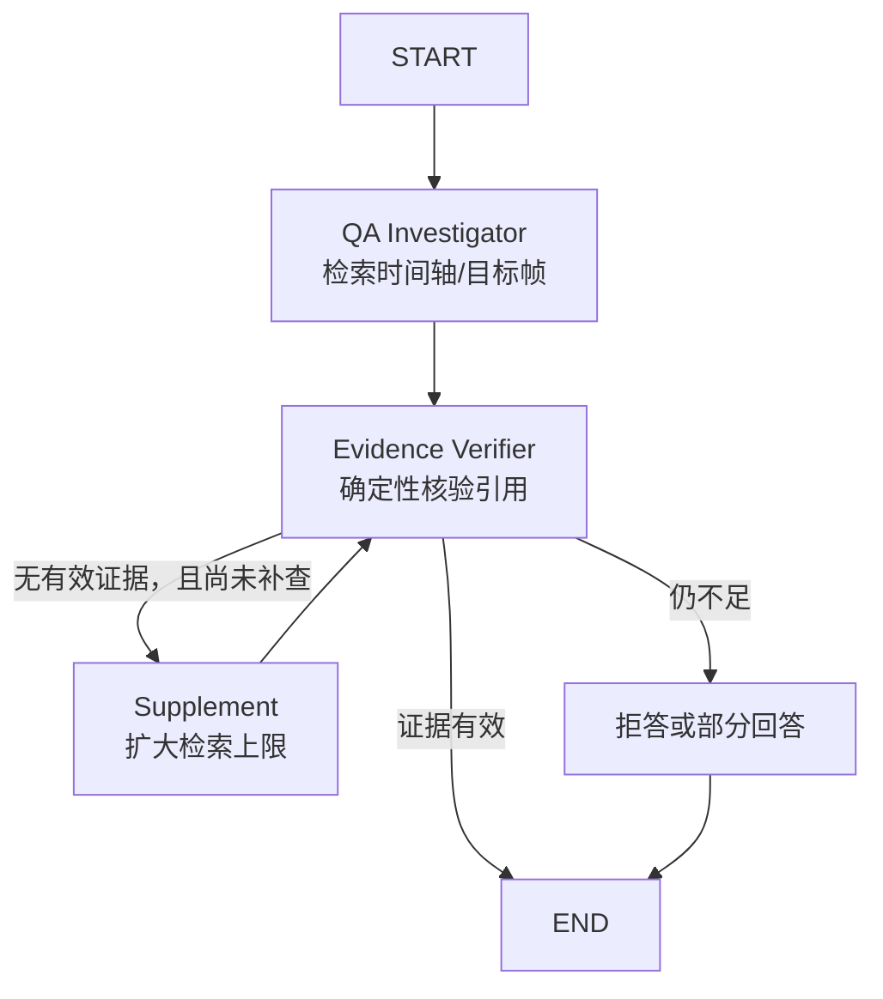

# Agent Harness 设计说明

> 状态：P0 QA 路径已实现；真实模型调用与完整处理图尚未接入。

## 1. Harness 是什么

Agent Framework 和 Agent Harness 解决的是不同问题：

- **LangGraph** 描述“先调查、再核验、必要时补充检索一次”的状态图。
- **角色 Agent** 描述谁负责规划、整理、调查和核验。
- **Agent Harness** 是所有 Agent 共享的运行护栏：预算、工具权限、结构化参数、超时、重复循环保护、Trace 和停止原因。

可以把 LangGraph 理解成“流程图”，把 Harness 理解成“带保险丝、仪表盘和权限系统的执行舱”。

## 2. 为什么不直接让模型自由调用工具

视频里的字幕、OCR、弹幕和网页元数据都属于不可信输入。它们可能包含类似“忽略规则并执行命令”的文本。如果模型能够直接访问 Shell、数据库或任意网络，这类内容可能从普通证据升级为真实操作。

本项目要求：

- Agent 只能调用角色白名单内的注册工具。
- 工具输入和输出都必须经过 Pydantic 模型校验。
- 工具 Handler 只能调用应用端口，不向 Agent 暴露数据库连接、Shell 或通用 HTTP 客户端。
- 工具在调用前记账并检查预算，而不是执行结束后才统计。
- 相同工具和相同参数重复超过阈值时立即停止。
- Trace 只保存公开步骤和结果摘要，不保存隐藏思维链。

## 3. 当前 QA 图



补查最多一次。除此之外，Harness 还用步骤数、工具次数、模型次数、Token、费用、时间和重复调用阈值共同限制执行。

## 4. P0 的 ReAct、Agentic RAG 与 Multi-Agent

### ReAct

当前图保留了 ReAct 的核心思想：先通过工具观察视频证据，再根据观察结果行动，并在核验失败时做一次补充观察。它是**有界 ReAct**，不是让模型无限循环地产生 Thought/Action。

### Agentic RAG

当前 Agentic RAG 由以下部分构成：

1. 问题范围转成 `global/range/moment/frame` 目标。
2. Agent 调用时间轴检索工具。
3. 时刻和当前帧问题追加画面检查工具。
4. 结构化证据进入回答 Composer。
5. Verifier 校验引用后才放行。

当前检索器是针对内存时间轴的轻量匹配，不是 Qdrant 语义检索；Qdrant 适配器和 embedding 生成尚未装配。

### Multi-Agent

代码中有四个专业角色，但当前运行图只启用了两个：

| 角色 | 是否进入当前主路径 | 说明 |
| --- | --- | --- |
| Processing Planner | 否 | 能生成经济/平衡/高精度处理计划 |
| Timeline Curator | 否 | 有确定性章节回退，未接真实多轨结果 |
| QA Investigator | 是 | 检索并组织证据 |
| Evidence Verifier | 是 | 独立核验引用与时间范围 |

“调查者和核验者分离”能减少同一个角色既生成结论又给自己打分的问题。P1 才会把 Planner 和 Curator 接入由 Worker/Temporal 驱动的处理图。

### 为什么不使用 AutoGPT 或 CrewAI

- 没有引入 AutoGPT。视频问答需要可预测、可预算和可回放，通用无限自治循环不符合这个约束。
- 没有引入 CrewAI。当前使用 LangGraph 显式表达状态和路由，用自定义 Harness 统一治理。角色分工思想被保留，但不为了“多 Agent”标签增加第二套编排框架。
- 若未来比较框架，必须以相同数据集的准确率、引用有效率、成本和延迟做评测，而不是按名词数量决策。

## 5. Harness 运行对象

`AgentRun` 是可持久化、可展示的运行记录：

- `agent_name` 与 `agent_version`
- `video_id` 与 `conversation_id`
- `status`
- `budget`
- `usage`
- `steps`
- `stop_reason`
- 开始与结束时间

`AgentStep` 只记录：

- 步骤序号
- 类型（工具或模型）
- 名称
- 状态
- 公开摘要
- 耗时

禁止把模型隐藏思维链、完整凭据、原始视频二进制或大段敏感字幕写入 Trace。

## 6. 预算模型

默认预算来自环境配置和 `RunBudget`：

| 预算 | 当前默认值 | 作用 |
| --- | ---: | --- |
| 最大步骤数 | 12 | 限制图和工具总推进次数 |
| 最大工具调用 | 10 | 防止检索/截图工具失控 |
| 最大模型调用 | 6 | 控制 LLM/VLM 次数 |
| 最大 Token | 12,000 | 控制上下文和输出 |
| 最大估算费用 | 0.10 USD | 调用前硬限制 |
| 最长运行时间 | 60 秒 | 问答级 deadline |
| 相同调用最多重复 | 2 次 | 阻止工具循环 |

`BudgetLedger` 使用异步锁，在并发调用前预留预算，避免多个请求同时越过“尚未记账”的窗口。

当前 Mock Composer 的模型成本为 0；这只能说明演示没有发起付费调用，不能作为真实模型成本结论。成本模型见 [cost-model.md](../cost/cost-model.md)。

## 7. 工具模型

每个工具必须注册 `ToolSpec`：

```text
name
description
input_model
output_model
handler
timeout_seconds
```

当前 QA Agent 的工具白名单：

| 工具 | 输入 | 输出 | 当前后端 |
| --- | --- | --- | --- |
| `search_timeline` | video_id、query、target、limit | `EvidenceBatch` | InMemoryRetrieval |
| `inspect_frame` | video_id、timestamp_ms、query | `EvidenceBatch` | InMemoryFrameInspector |

当前 `inspect_frame` 返回目标时刻附近已经存在的视觉/OCR 证据，并不实时调用 FFmpeg、OCR 或 VLM。真实帧检查在 P1 装配媒体适配器后实现。

## 8. 失败与降级语义

| 情况 | Run 状态 | 回答行为 |
| --- | --- | --- |
| 证据完整 | `completed` | `answered` |
| 有部分有效引用 | `insufficient_evidence` | `partial` |
| 无有效引用 | `insufficient_evidence` | `abstained` |
| 达到预算 | `budget_exhausted` | 拒答并说明预算限制 |
| 工具越权/循环 | `policy_denied` | 拒答并说明策略拒绝 |
| 未处理异常 | `failed` | API 交给统一错误层 |

生产版本还需要区分供应商限流、可重试工具错误、输入错误和不可重试策略错误。

## 9. Evidence Verifier 的保证与局限

P0 Verifier 已检查：

- 引用的 Evidence ID 必须存在。
- 时间戳不能超过已知视频时长。
- 时间戳必须落在证据自己的时间范围内。
- 无有效引用时不允许输出“已回答”状态。

P0 Verifier 尚未检查：

- 每个自然语言主张是否被证据语义蕴含。
- 截图中的区域是否真的支持 OCR 文本。
- 多段证据是否彼此矛盾。
- 说话人标签是否稳定。

P1 可加入轻量 NLI/Verifier 模型，但模型判断也必须保留确定性检查和拒答路径。

## 10. Trace 与可观测性

当前 `GET /agent-runs/{run_id}` 可返回公开步骤、用量和停止原因。OpenTelemetry 与 Langfuse 属于适配与部署预留，尚未完成端到端 Trace 导出。

推荐的 Span 层级：

```text
video.question
├── graph.investigate
│   ├── tool.search_timeline
│   └── tool.inspect_frame
├── model.compose
└── graph.verify
```

所有 Span 至少应包含 `trace_id`、`video_id`、目标类型、模型/工具版本、耗时、Token、估算费用和状态；不得包含 API Key 或隐藏思维链。

## 11. 与应用内 Skill 的关系

未来 Skill 可以声明：

- 适用的视频类型。
- 额外领域术语和示例。
- 允许使用的既有工具子集。
- 处理档位和检索参数建议。
- 输出格式和评测集。

Skill 不能：

- 注册任意 Shell 或通用网络工具。
- 提高系统硬预算。
- 关闭引用核验、SSRF 或版权确认。
- 直接访问数据库和对象存储。

Skill Loader 尚未实现。当前 `extensions/skills/.../SKILL.md` 是应用协议草案，不会被运行时自动加载。

