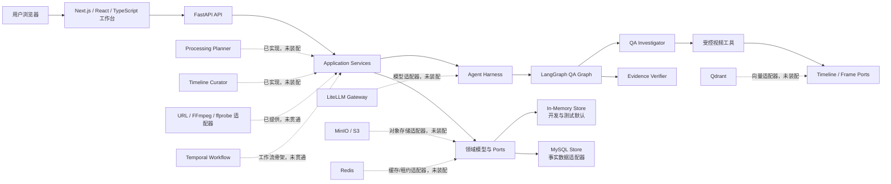
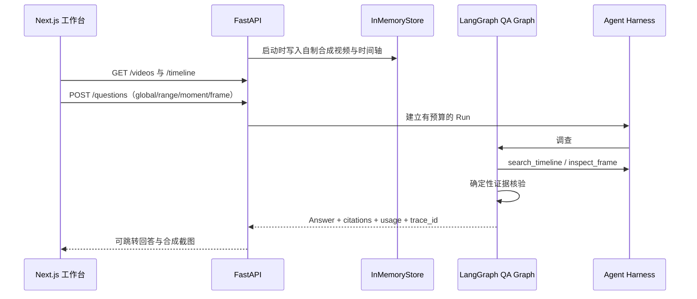

# LetsGoVideoAgent 系统架构总览

> 文档范围：`v0.1.0 / P0 Foundation`  
> 最后核对：2026-07-31  
> 本文描述当前代码仓库的真实状态，不把依赖声明、配置项或接口骨架算作“已完成能力”。

## 1. 一句话定位

LetsGoVideoAgent 是一个面向通用视频的“证据优先”理解系统：它把字幕、说话人、OCR、画面描述、镜头和章节统一到同一条时间轴，再让受预算和工具权限约束的 Agent 回答全视频、时间段、时刻或当前帧问题，并返回可跳转的时间戳和截图证据。

当前仓库已经完成可运行的 P0 基础垂直切片：合成视频夹具、四种问答范围、结构化证据、受控 Agent Harness、LangGraph 调查/核验图、FastAPI 接口和 Next.js 工作台可以连通。真实视频的下载、转码、ASR、说话人分离、OCR、VLM 和向量化尚未形成端到端处理链。

## 2. 能力状态图例

| 标记 | 含义 |
| --- | --- |
| ✅ 已实现 | 已进入当前运行路径，并有自动化测试或可重复的本地演示 |
| 🟡 适配器已提供 | 有明确接口和实现，可用 Fake Client/Runner 离线测试，但尚未装配到主运行路径 |
| 🧩 基础设施/配置预留 | 依赖、环境变量或容器已准备，业务适配器或端到端链路仍未接通 |
| ⏳ P1 | 设计已预留，本版本不承诺 |

## 3. P0 的产品边界

P0 Foundation 解决以下问题：

- 用统一领域模型表达视频、来源、时间范围、多轨时间轴、证据、问题、回答和 Agent Run。
- 支持本地文件上传和公开网页 URL 登记，并要求用户显式确认内容处理权利。
- 提供全视频、当前章节、指定时刻和当前帧四种提问范围。
- 回答必须关联视频内证据；证据不足时允许拒答或部分回答。
- 用自定义 Agent Harness 统一执行预算、工具白名单、参数校验、超时、重复循环保护和公开 Trace。
- 前后端分离，Python 负责 Agent 与媒体后端，TypeScript 负责交互工作台。
- 保留 MySQL、Qdrant、MinIO、Redis、Temporal、LiteLLM、OpenTelemetry/Langfuse 的演进边界。

P0 Foundation 不等于完整的视频 AI 产品。本阶段不承诺：

- 对任意网站都能稳定下载视频，或绕过登录、付费、DRM、地区与反爬限制。
- 真实视频上传后立即完成 ASR、说话人分离、OCR、VLM 和语义分段。
- 对人脸身份、敏感属性或版权状态作自动判断。
- 多租户、账号权限、配额计费和公网生产部署。
- 由 Agent 自由执行 Shell、任意网络请求或无限自治任务。

## 4. 总体架构



虚线表示代码、适配器或部署资源存在，但当前 API 启动容器还没有把它装配成一条真实媒体处理链。

## 5. 分层和依赖方向

后端采用 Ports and Adapters（端口与适配器）思路：

```text
API / Entrypoints
       ↓
Application Services
       ↓
Domain + Ports
       ↑
Infrastructure Adapters
```

关键约束：

- `domain/` 不依赖 FastAPI、SQLAlchemy、LangGraph 或具体云服务。
- `application/` 通过 Protocol 端口调用仓库、检索和帧检查能力。
- `infrastructure/` 实现 MySQL、内存仓库及外部服务适配器。
- `agents/` 只经注册工具访问应用端口，不直接拿数据库连接、Shell 或下载器。
- `api/` 只完成协议转换、依赖注入和错误映射，不放业务判断。
- 前端只依赖 HTTP 契约，不读取后端存储或模型 SDK。

这种结构的价值不是“目录多”，而是可以在不修改 Agent 逻辑的前提下，把内存检索替换为 Qdrant，把本地文件替换为 MinIO，把 Mock Composer 替换为真实模型网关。

## 6. 当前真实运行路径

### 6.1 合成演示路径（✅ 已实现）



该路径不使用第三方视频，也不调用付费模型，适合 CI、E2E 和本地演示。

### 6.2 上传路径（✅ 登记与安全存储；处理未贯通）

1. API 接收 MP4/MOV/MKV/WebM。
2. `LocalUploadStore` 检查扩展名和大小，以 UUID 生成对象键，流式写入并计算 SHA-256。
3. 数据库记录进入 `queued_for_probe`。
4. 当前到此停止。播放器、ffprobe、转码与模型处理还没有由主应用自动触发。

### 6.3 URL 路径（✅ 安全登记；🟡 下载适配器未装配）

1. API 校验协议、显式凭据、localhost、单标签主机和字面私网 IP。
2. 未确认权利时，只登记 URL 和“等待权利确认”状态，尚不抓取网页元数据。
3. 确认权利时，记录进入 `queued_for_metadata`。
4. yt-dlp 元数据/下载适配器已按“元数据”和“授权下载”分开设计，但尚未装配进 `VideoService` 和 Worker。
5. 下载时必须补做 DNS 结果、每次重定向和最终连接地址的 SSRF 校验。

### 6.4 问答路径（✅ 已实现，当前使用离线证据）

- `QAInvestigator` 调用 `search_timeline`。
- 对 `moment` 和 `frame` 目标额外调用 `inspect_frame`。
- `EvidenceVerifier` 检查引用是否存在、时间戳是否落在视频和证据范围内。
- 无有效引用则拒答；部分引用异常则降级为部分回答。
- 当前 Composer 是确定性的 Mock 实现；它会登记一次模型预算，但没有发出真实 LLM 请求。

## 7. Agent 角色状态

| 角色 | 职责 | 当前状态 |
| --- | --- | --- |
| Processing Planner | 根据时长和成本档位制定处理计划 | ✅ 类已实现；尚未接入 Worker |
| Timeline Curator | 融合多轨结果并生成语义章节 | ✅ 一分钟桶离线回退已实现；真实语义融合未接入 |
| QA Investigator | 针对问题检索时间轴和目标帧证据 | ✅ 已接入 QA Graph |
| Evidence Verifier | 核验引用、范围并决定回答/降级/拒答 | ✅ 已接入 QA Graph |

因此当前准确说法是“面向多 Agent 的角色化架构，QA 双角色闭环已运行”，而不是“四个 Agent 已全部协同处理真实视频”。

Agent Harness 的详细约束见 [agent-harness.md](./agent-harness.md)。

## 8. 数据与存储职责

| 数据 | 权威来源 | 当前实现 | 演进方向 |
| --- | --- | --- | --- |
| 视频状态、来源、问题、回答、Run | MySQL | 内存默认；MySQL Store 已提供 | MySQL 8.4 |
| 原始视频、音频、关键帧、截图 | 对象存储 | 本地上传目录 | MinIO/S3 |
| 字幕、OCR、画面描述、章节 | 时间轴事实表 | 内存/MySQL 数据模型 | MySQL + 可重建派生索引 |
| 向量 | 可重建派生数据 | 尚未生成 | Qdrant |
| 短期缓存、幂等租约 | 非权威数据 | Redis 适配器已提供、未装配 | Redis |
| 长任务状态 | 工作流引擎 | Inline 状态字符串 | Temporal |

原则是：MySQL 保存业务事实，Qdrant、缓存和中间文件都必须可由事实数据或原始媒体重建。

## 9. 前端为什么使用 Node.js 和 TypeScript

Node.js 在本项目中是前端构建与开发运行时，不负责核心 Agent 推理。选择 Next.js、React 和 TypeScript 的原因是：

- 视频工作台需要播放器、时间轴、聊天、证据卡片和流式状态等复杂交互。
- TypeScript 能让 API DTO、四种问题范围和证据结构在编译期被检查。
- Next.js 便于后续加入服务端渲染、鉴权中间件和部署优化。
- Python 仍是媒体处理、模型生态和 Agent 编排的主语言；Node.js 不应重复实现这部分业务。

所以“需要 Node.js”与“整个 Agent 后端改用 Node.js”是两件事。当前的 Python 后端 + TypeScript 前端是有意的职责分工。

## 10. 外部基础设施状态

仓库会提供 Docker Compose、后端/前端镜像、Taskfile 和 CI：

- MySQL 8.4 有真实仓库适配器。
- Qdrant、MinIO/S3、Redis、Temporal、LiteLLM 有配置、容器或适配器预留。
- Docker 与 Compose 只完成静态校验和镜像构建检查；尚未声明已完成真实视频 Docker E2E。
- B 站数据集只作人工授权测试清单，CI 不下载第三方视频。

详细状态以 [P0 状态页](../roadmap/p0-status.md) 为准。

## 11. P1 扩展点

P1 预留而不在 P0 冒充完成的能力：

- 完整 ASR、说话人分离、OCR、场景检测和 VLM 适配器。
- 由 Temporal 驱动的断点续跑、重试、取消和进度事件。
- Qdrant 混合检索、重排与跨视频知识库。
- 真实模型路由、降级、缓存和单价表。
- 应用内 Skill 注册、选择、版本化和评测。
- MCP Server，把受控视频工具暴露给外部 Agent 客户端。
- 多租户 RBAC、审计、保留期和数据删除。

应用内 Skill 的设计约束见 `extensions/skills/general-video-understanding/SKILL.md`；它不是 Codex Skill。
