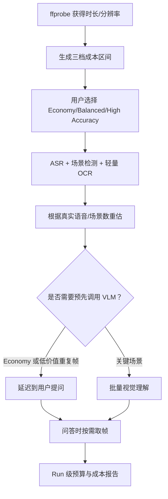

# LetsGoVideoAgent 成本模型

> 目标：在处理前可估算、处理中可限额、处理后可解释。  
> 当前状态：Harness 预算与用量字段已实现；真实供应商调用、动态单价表和聚合报表尚未接通。

## 1. 为什么视频 Agent 容易失控

视频成本不只来自一次聊天。一个长视频可能依次触发：

- 下载与网络流量。
- 音频抽取和转码。
- ASR 与说话人分离。
- 关键帧抽取、OCR、VLM。
- Embedding 和向量存储。
- 语义分段与摘要。
- 用户每一轮问答的检索、截图和模型调用。
- 原视频、音频、关键帧、索引和 Trace 的长期存储。

如果逐帧调用 VLM，30 FPS 的一小时视频会产生 108,000 帧，成本和延迟都不可接受。P0 的设计核心是“场景/关键帧优先，按需深度理解”，而不是逐帧推理。

## 2. 总成本公式

单个视频生命周期成本可写为：

```text
C_total =
  C_ingest
  + C_media_compute
  + C_asr
  + C_diarization
  + C_ocr
  + C_vlm
  + C_embedding
  + C_curation
  + Σ C_question
  + C_storage
  + C_egress
```

其中：

```text
C_asr          = duration_minutes × asr_price_per_minute
C_diarization  = duration_minutes × diarization_price_per_minute
C_ocr          = ocr_frame_count × ocr_price_per_frame
C_vlm          = Σ visual_request_price(resolution, input_tokens, output_tokens)
C_embedding    = embedded_tokens / 1,000,000 × embedding_price_per_million_tokens
C_question     = llm_input_tokens × input_rate
               + llm_output_tokens × output_rate
               + on_demand_visual_calls × visual_rate
C_storage      = GB_months × storage_rate
C_egress       = downloaded_or_served_GB × egress_rate
```

供应商计价方式不同，实际实现应把统一用量归一化后再按 Provider 价格表结算。

## 3. 估算输入

| 变量 | 含义 | 获取时机 |
| --- | --- | --- |
| `duration_seconds` | 视频时长 | ffprobe 后 |
| `audio_track_count` | 音轨数 | ffprobe 后 |
| `scene_count` | 镜头/场景数 | 场景检测后 |
| `keyframe_count` | 计划送 OCR/VLM 的帧数 | Processing Plan 后 |
| `speech_minutes` | 实际有人声的分钟数 | VAD 后 |
| `ocr_frame_count` | 有文字可能性的帧数 | 轻量筛选后 |
| `transcript_tokens` | 字幕 Token 数 | ASR 后 |
| `visual_calls` | VLM 请求数 | 计划与按需问答 |
| `qa_turns` | 预计问答轮数 | 用户或产品档位 |
| `retention_days` | 原始和派生数据保留期 | 项目策略 |

处理前只有时长与文件大小时，应给出区间估算；每完成一个阶段再更新估算。

## 4. 三档处理策略

`ProcessingPlanner` 当前实现了三个档位，其关键帧最大间隔为：

| 档位 | 最大关键帧间隔 | 视觉策略 | 适用场景 |
| --- | ---: | --- | --- |
| Economy | 12 秒 | 深度视觉尽量延迟到提问时 | 长视频、个人低成本使用 |
| Balanced | 6 秒 | 对关键场景做预理解 | 默认通用档 |
| High Accuracy | 3 秒 | 更密集覆盖 | 短视频、画面信息密集任务 |

当前估算逻辑：

```text
estimated_visual_calls = max(1, floor(duration_seconds / interval_seconds))
```

它是保守的上界提示，不是已发生的实际调用。真实实现还应通过镜头检测、相似帧去重、文字检测和问题相关性把调用数进一步压低。

### 一小时视频的帧数上界示例

| 档位 | 计算 | 估算帧数 |
| --- | --- | ---: |
| Economy | 3600 / 12 | 300 |
| Balanced | 3600 / 6 | 600 |
| High Accuracy | 3600 / 3 | 1,200 |

这只是算法数量示例，不包含任何供应商价格。实际金额由所选 OCR/VLM 的单价、图片分辨率和批处理方式决定。

## 5. 当前问答硬预算

P0 Harness 默认：

| 项目 | 默认值 |
| --- | ---: |
| 最大步骤 | 12 |
| 最大工具调用 | 10 |
| 最大模型调用 | 6 |
| 最大 Token | 12,000 |
| 最大估算费用 | 0.10 USD |
| Deadline | 60 秒 |
| 相同工具+参数重复 | 2 次 |

预算在调用前预留，并发调用共享同一个带锁账本。达到任一上限时，Agent 停止并返回可解释的预算不足结果。

当前开发环境已可配置 DeepSeek V4 Flash。媒体探测、关键帧、Whisper ASR 和 RapidOCR
均在本地执行；DeepSeek 用于“融合字幕与 OCR 生成章节摘要”以及“基于检索证据组织问答”。
每次调用根据响应中的缓存命中、缓存未命中和输出 Token，按人民币单价写入
`data/costs/model-usage.jsonl`，可通过 `GET /api/v1/costs/summary` 查询。

## 6. 模型路由状态

环境配置已预留：

- `MODEL_PROFILE`
- `LLM_PROVIDER / LLM_MODEL`
- `VLM_PROVIDER / VLM_MODEL`
- `EMBEDDING_PROVIDER / EMBEDDING_MODEL`
- 各自 API Base 和 Key

LiteLLM 模型网关适配器会负责：

- 统一文本/视觉请求协议。
- 把供应商用量归一化为输入 Token、输出 Token 和估算费用。
- 记录模型名、Provider 与请求类型。
- 为超时、限流和 Provider 错误提供清晰异常。

当前适配器尚未装配到 QA Composer 和处理 Worker，所以“可配置模型”目前是接口能力，不是已完成的端到端切换。

## 7. 推荐的成本决策顺序



建议默认策略：

- ASR 一次生成，可被所有问题复用。
- OCR 先跑高文字概率关键帧。
- VLM 不分析相似帧，不分析纯黑转场，不逐帧调用。
- 全局摘要尽量使用压缩后的章节证据，不把整份字幕重复发送。
- 当前帧问题只分析目标帧和必要的邻域帧。
- 使用缓存键：媒体哈希 + 时间戳 + 模型 + Prompt 版本。

## 8. 成本报告数据结构建议

每一次处理阶段和 Agent Run 至少记录：

```json
{
  "video_id": "...",
  "trace_id": "...",
  "stage": "qa.compose",
  "provider": "mock",
  "model": "mock-evidence-model",
  "input_tokens": 0,
  "output_tokens": 0,
  "image_count": 0,
  "audio_seconds": 0,
  "tool_calls": 1,
  "estimated_cost_usd": "0.000000",
  "pricing_version": "unpriced-mock",
  "cache_hit": false,
  "started_at": "...",
  "elapsed_ms": 12
}
```

金额使用 Decimal 或最小货币单位，禁止用二进制浮点累计账单。价格表要有生效时间和版本，否则历史账单会被新价格“重算”。

## 9. 报告维度

处理完成后应能回答：

- 这个视频总共花了多少，按阶段如何分布？
- 哪个模型、哪些帧最贵？
- 多少调用命中缓存？
- 每分钟视频的处理成本是多少？
- 每轮问答的平均和 P95 成本是多少？
- Economy 与 Balanced 的准确率提升是否值得额外成本？
- 因预算停止的 Run 占比是多少？

当前具备 Run 级 `ModelUsage`、人民币 JSONL 成本账本和聚合查询接口；MySQL 成本聚合表与
独立成本页面仍是 P1 工作。

## 10. 供应商无关的示例计算

假设一个 60 分钟视频：

```text
语音分钟数 = 48
OCR 帧 = 180
Balanced 候选视觉帧 = 600
去重后实际 VLM 帧 = 90
字幕 + OCR embedding tokens = 45,000
预计问答 = 20 轮
```

令：

```text
a = ASR 每分钟单价
o = OCR 每帧单价
v = VLM 每帧平均单价
e = Embedding 每百万 Token 单价
q = 单轮文本问答平均单价
```

则不含存储和流量的估算为：

```text
C ≈ 48a + 180o + 90v + 0.045e + 20q
```

把具体供应商价格带入时必须注明币种、区域、模型版本、计价日期和是否含税。仓库不硬编码易过期的宣传价格。

## 11. 成本验收门槛

真实模型接入前：

- [x] Run 有模型、工具、Token、费用和耗时字段。
- [x] 调用前有硬预算。
- [x] 超预算会安全停止。
- [ ] Provider 返回用量与内部用量对账。
- [ ] 价格表版本化。
- [ ] 处理前给出三档估算。
- [ ] 阶段级和视频级成本聚合。
- [ ] 缓存命中计量。
- [ ] 评测报告同时展示质量、延迟和成本。
