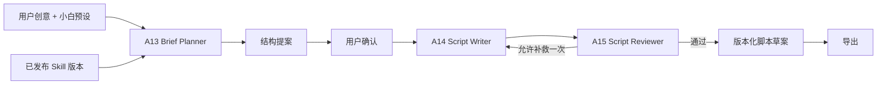

# v1.1 Script Studio：基于垂类 Skill 的视频脚本生成

> 状态：需求与架构设计，尚未进入当前 OpenAPI。  
> 目标：用户只提供一句创意或粗略思路，也能在可控成本下生成符合该类视频规律、可继续修改和可评估的视频脚本。

## 1. 产品定位

Script Studio 不负责复制某一个 UP 主的原话，而是复用已发布垂类 Skill 中可泛化的内容规律：

- 这类视频通常解决什么问题、面向什么受众；
- 常见开场、信息组织、叙事节奏和结尾方式；
- 画面承担什么信息，口播承担什么信息；
- 专业术语、事实核验规则、分段线索和禁用模式；
- 适合该类视频的脚本结构、默认问题和质量标准。

Skill 是版本化的运行时上下文与约束，不是模型微调，也不会永久写入模型权重。每个脚本草案必须记录 `source_skill_id` 和 `source_skill_version`，确保结果可复现。

## 2. 用户流程

```text
选择一个已发布垂类 Skill
  → 输入一句创意或粘贴粗略脚本
  → 选择“小白预设”或打开高级选项
  → 生成结构提案
  → 用户确认/调整结构
  → 生成完整脚本与分镜建议
  → 事实、风格、可拍摄性和原创性评估
  → 自然语言继续修改，形成 v2/v3
  → 导出 Markdown / JSON / 字幕 / 分镜表
```

结构提案和完整脚本分两步生成，可以减少方向错误时的 Token 与费用浪费。

## 3. 小白模式

页面首先展示少量易懂选项，由所选 Skill 给出推荐值；用户不必理解 Temperature、Token 或 Agent 步数。

### 3.1 快速模板

- 快速成稿：使用 Skill 推荐值，只要求一个主题；
- 强钩子短视频：先给冲突/收益点，再快速交付信息；
- 教程攻略：目标、前置条件、步骤、常见错误、总结；
- 故事讲述：人物/背景、矛盾、发展、转折、收束；
- 评测解析：结论先行、证据、优缺点、适用人群；
- Vlog 提纲：场景推进、情绪节点、现场口播和补拍清单。

### 3.2 建议选项

| 选项 | 建议值 |
| --- | --- |
| 发布平台 | B 站、抖音、小红书、YouTube、通用横屏 |
| 目标时长 | 30 秒、60 秒、3–5 分钟、8–10 分钟、自定义 |
| 目标 | 解释知识、提供攻略、讲故事、评测、记录、转化 |
| 受众 | 新手、进阶用户、专业观众、泛兴趣用户 |
| 语气 | 轻松、专业、克制、幽默、情绪化 |
| 形式 | 单人口播、对话、旁白、教程、故事、Vlog |
| 成品内容 | 大纲、完整口播、分镜、屏幕文字、字幕、标题/封面文案、CTA |
| 创意幅度 | 保守、平衡、创意；默认“平衡” |

“推荐”必须来自 Skill 的类别画像和样本统计，并说明推荐理由；不是前端写死的同一组答案。

## 4. 高级模式

高级用户可以补充：必须包含/禁止出现的内容、已有素材、人物设定、事实来源、结构偏好、每段预计时长、参考视频、最大成本、联网核验和生成候选数量。

可以调整的是 Harness 的软限制：

- 生成 1/2/3 个候选版本；
- 最大修改轮次；
- 最大 Token 与用户费用预算；
- 是否允许联网核验；
- 是否分析参考帧；
- 创意幅度与事实严格度；
- 输出组件数量。

不能由用户或 Skill 突破的是系统硬限制：

- Agent/工具/MCP 白名单；
- 系统最大步骤、费用、运行时间和并发；
- 禁止任意 Shell、文件系统和通用网络访问；
- 内容安全、版权、隐私和引用规则；
- 不暴露隐藏思维链、系统 Prompt 和密钥。

有效权限与预算按下式计算：

```text
有效运行策略 = 系统硬上限 ∩ 已发布 Skill 契约 ∩ 用户本次配置
```

用户可以缩小限制，或在系统允许范围内选预设，不能把它扩大到系统上限之外。

## 5. 多 Agent 工作流

v1.1 实现时在现有 A00–A12 注册表后增加以下计划角色，并统一进入 Trace、成本与运行观测：

| 计划编号 | 角色 | 职责 | 模型/算法 |
| --- | --- | --- | --- |
| A13 | Script Brief Planner | 把模糊想法整理为受众、目标、结构和缺失信息 | DeepSeek + 结构化输出 |
| A14 | Script Writer | 按结构生成口播、段落、屏幕文字与分镜建议 | DeepSeek；可替换文本 LLM |
| A15 | Script Reviewer | 检查事实、Skill 契合度、重复、可拍摄性与原创性 | 规则 + DeepSeek Judge + 可选搜索 |

Qwen3-VL 不负责整篇写作。只有用户提供参考视频/图片，或脚本需要分析类别画面构图、UI、动作和可视素材时，才由 A05 产生结构化视觉约束供 A13/A14 使用。



默认只允许一次自动补救。继续修改由用户发起，生成新的脚本版本，而不是覆盖旧版本。

## 6. 脚本数据结构

脚本不能作为一段无法审计的长字符串保存。建议核心对象：

```text
ScriptProject
├─ id / title / idea
├─ source_skill_id / source_skill_version
├─ brief（平台、时长、目标、受众、语气、事实约束）
├─ harness_profile / budget
└─ ScriptDraft[]
   ├─ version / status / created_at
   ├─ outline
   ├─ blocks[]
   │  ├─ index / estimated_time_range
   │  ├─ purpose
   │  ├─ narration_or_dialogue
   │  ├─ visual_direction
   │  ├─ on_screen_text
   │  └─ source_or_creative_flag
   ├─ validation_report
   ├─ usage / trace_id
   └─ exports
```

事实陈述需要来源或标记为“待核验”；创作性桥段需要标记为“创意内容”，不能伪装成原视频事实。

## 7. 质量评估

每个草案至少评估：

- 主题和用户目标覆盖；
- 与所选 Skill 的内容结构、画面表达和节奏契合度；
- 事实正确性、专业术语和来源完整度；
- 每一段是否有明确目的，口播和画面是否互相补充；
- 预计时长是否合理；
- 重复、空话、机械总结和不可拍摄描述；
- 与样本原文的近似程度，防止大段照抄或过度模仿单一创作者；
- Token、人民币成本、延迟和自动补救次数。

发布/导出前允许人工忽略软告警，但事实硬错误、缺失必要来源、预算超限和策略越权应阻止自动通过。

## 8. UI 布局原则

Script Studio 采用单一任务焦点：

1. 左侧是脚本项目与历史版本；
2. 中间是当前结构/脚本编辑与预览；
3. 右侧是本次生成配置、Skill 版本和评估结果；
4. Agent 运行详情通过可放大的观测抽屉打开，不长期挤压编辑区；
5. “生成新脚本”和“继续修改当前脚本”必须是两个视觉和语义都不同的操作。

## 9. v1.1 验收标准

- 可以选择一个明确版本的已发布 Skill 创建脚本项目；
- 一句话创意可在小白预设下生成结构提案和完整脚本；
- 脚本每段包含用途、口播/对白、画面建议和预计时长；
- 可以自然语言修改并保留 v1/v2 差异；
- 运行观测能看到 A13–A15、模型、工具、费用、进度和停止原因；
- 有无 Skill 的脚本质量可以用同一量表对比；
- 用户调整只影响软预算，无法突破 Harness 安全边界；
- 结果可导出，且 API、Pydantic、MySQL/Alembic、测试和 OpenAPI 同步落地。
