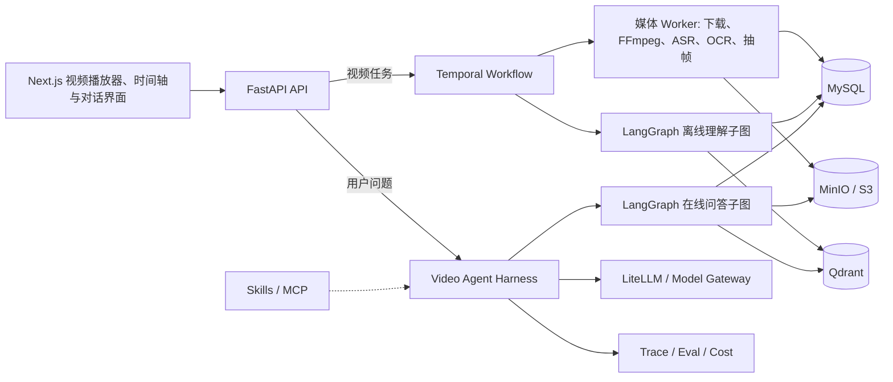

# 通用视频理解 Multi-Agent 系统

## 1.0 需求规格说明书

> Video Understanding Multi-Agent System - Software Requirements Specification

| 文档属性 | 内容 |
|---|---|
| 项目版本 | 1.0 |
| 文档版本 | 1.0 |
| 文档状态 | 需求基线版 |
| 编制日期 | 2026-07-30 |
| 项目性质 | 个人求职作品 / 可持续演进的通用 Agent 产品 |
| 核心定位 | 将任意视频转化为可搜索、可定位、可追溯的时空知识库，并支持带时间戳和画面证据的多轮问答 |

<!-- PDF_BODY_START -->

# 1. 文档说明

## 1.1 编写目的

本文档定义“通用视频理解 Multi-Agent 系统”1.0 版本的产品背景、目标用户、功能范围、端到端工作流程、Agent 设计、数据模型、技术栈、非功能要求、成本策略、评测体系和验收标准。

本文档同时承担以下作用：

- 作为 1.0 版本的需求基线，约束后续设计和实现范围。
- 作为 Spec-Driven Development 的输入，后续任务必须能够追溯到需求编号。
- 作为架构评审、测试设计、成本评估和项目复盘的共同依据。
- 作为求职展示材料，说明项目不是一次模型 API 调用，而是完整的 Agent 工程系统。

## 1.2 目标读者

- 项目开发者和未来协作者。
- 负责 Agent、后端、前端、算法、测试或运维的工程人员。
- 需要理解项目业务价值和技术取舍的面试官。
- 后续为游戏、课程、Vlog、体育等领域开发 Skill 的扩展者。

## 1.3 文档范围

本文档中的“1.0”指可独立部署、可演示、可评测的首个完整版本。1.0 保持内容类型通用，但收紧能力边界，优先完成：

> 视频导入 -> 多模态处理 -> 自动分段 -> 时空知识库 -> 全局与局部问答 -> 时间戳与截图证据 -> Trace、评测和成本报告。

ROI 框选、跨视频推理、完整领域 Skill、实时直播理解等能力属于后续版本，不作为 1.0 上线阻塞项。

## 1.4 文档约定

- `必须`：1.0 验收所需能力。
- `应该`：对完整体验重要，允许在不破坏主流程的情况下延后修复。
- `可以`：增强项，不阻塞 1.0 验收。
- `P0`：1.0 必须交付。
- `P1`：1.0 后的优先增强。
- 时间统一使用毫秒时间戳，字段形式为 `start_ms` 和 `end_ms`。
- 所有模型推断结果必须记录模型、Prompt、Schema 和 Skill 版本。

# 2. 项目背景与问题定义

## 2.1 背景

视频已经成为课程、访谈、游戏、生活记录、软件教程、会议、体育和娱乐内容的重要载体。但传统视频的主要交互方式仍然是“从头播放”和“拖动进度条”，存在以下问题：

- 用户很难快速知道一个长视频讲了什么。
- 字幕只能解决“说了什么”，无法完整解释“画面展示了什么”。
- 单一摘要会丢失具体时间、场景和证据。
- 传统文本 RAG 通常只能检索字幕，无法理解某一帧、某个界面、某个动作或前后状态变化。
- 用户难以从回答直接回到原视频核验。
- 大模型逐帧处理成本过高，且容易产生无证据推断。

因此，本项目需要建立一种不同于“字幕总结器”的产品形态：把视频转换成带有时间、空间和来源信息的知识结构，并让 Agent 能够针对用户问题选择合适的检索和分析方式。

## 2.2 核心问题

系统需要解决四个核心问题：

1. 如何从本地文件或合法网页来源可靠地获得并规范化视频。
2. 如何融合语音、画面文字、镜头、场景、实体、动作和声音，形成通用时间轴。
3. 如何让 Agent 回答从全局总结到具体时刻、具体帧的不同问题。
4. 如何保证答案有证据、成本可控、过程可追踪、失败可恢复。

## 2.3 产品定位

本项目的产品定位为：

> 将任意视频转换为可检索、可追溯、带时空证据的视频知识库，并通过多 Agent 协作完成视频理解、时间定位、局部画面调查和证据化问答。

本项目不是：

- 只对课程或课件优化的学习工具。
- 只基于 ASR 字幕构建的聊天机器人。
- 对每一帧都调用昂贵视觉模型的暴力处理系统。
- 让多个 Agent 无限制自由聊天的演示项目。
- 绕过网站 DRM、登录、付费或版权控制的视频下载工具。

## 2.4 求职项目价值

项目需要真实体现以下工程能力：

- 多模态数据处理。
- 多 Agent 协作和状态图编排。
- Agent Harness、工具调用、权限、预算和上下文工程。
- ReAct、Agentic RAG、知识库和智能体工作流。
- MySQL、向量数据库、对象存储和缓存的组合设计。
- 长任务恢复、幂等、重试和异步进度。
- Trace、Eval、成本分析、Docker 和 CI/CD。
- Spec Coding、架构文档和技术选型决策。

# 3. 产品目标与设计原则

## 3.1 产品目标

### G-01 通用内容理解

系统必须能够处理课程、游戏、生活/Vlog、访谈、录屏等不同内容，不把“课件”写死进核心数据模型。

### G-02 时空可检索

系统必须能够把字幕、OCR、场景、事件、关键帧和摘要映射到统一时间轴，并允许按视频、章节、片段、时间范围、时刻和精确帧检索。

### G-03 证据化问答

系统回答必须尽可能返回可点击时间戳、字幕片段、截图或画面裁剪，并区分事实观察与模型推断。

### G-04 多 Agent 产品化

系统必须包含职责清晰、数量克制的多 Agent 工作流，并由统一 Agent Harness 管理状态、工具、预算、权限、Trace 和错误恢复。

### G-05 API 与成本可选择

模型供应商不得写死。用户或部署者必须可以为不同任务配置本地模型、OpenAI-compatible API 或其他供应商，并获得成本报告。

### G-06 可评测、可部署

系统必须提供 Docker Compose、自动化测试、持续评测、Trace、架构文档和一键演示路径。

## 3.2 非目标

1.0 不承诺：

- 绕过 DRM、登录、验证码、付费墙或网站访问控制。
- 直播的低延迟实时理解。
- 对每一帧持续运行大模型。
- 精确认出视频中所有人的真实身份。
- 进行人脸身份识别、声纹身份认证，或把匿名说话人标签等同于真实人物。
- 对视频中未出现的现实信息进行补全。
- 达到专业赛事裁判、医学诊断或司法取证级别的可靠性。
- 完美理解严重模糊、遮挡、高速运动或音画不同步的视频。
- 自动转载、分发或商业使用受版权保护的视频。
- 一开始支持所有网站和所有视频封装格式。
- 1.0 即完成跨视频知识库、复杂知识图谱或全功能工作流编辑器。

## 3.3 设计原则

### 智能默认值

普通用户默认只需选择视频并开始处理。系统根据时长、语言、对白密度、画面文字密度、运动强度和预算选择策略，高级配置默认折叠。

### 用户熟悉的交互

核心界面采用“播放器 + 多轨时间轴 + 片段列表 + 对话框”，答案中的时间戳和截图可直接跳转。

### 横向通用底座，纵向完整切片

核心模型保持通用，1.0 把“分段、定位、帧理解、证据问答”这一能力切片做完整，并使用课程/访谈、游戏、生活视频三类数据验收。

### 确定性优先

下载、转码、ASR、OCR、抽帧、哈希和索引写入由确定性 Worker 完成。只有需要判断、规划、融合和验证的步骤才使用 Agent。

### 证据优先

没有证据时允许回答“不确定”或“视频中无法判断”。模型不得把推测伪装成视频中直接发生的事实。

### 持续评测

任何模型、Prompt、Skill、检索策略或工作流变更都必须能够运行回归评测，并比较质量、延迟和成本。

# 4. 用户、场景与核心用例

## 4.1 目标用户

### 个人学习者

希望从课程、访谈和教程中快速获得结构化内容，并能回到原视频核验。

### 游戏和内容爱好者

希望定位游戏事件、解释 HUD、回顾操作或理解某段生活视频发生的事情。

### 知识工作者

希望把视频转换成可搜索、可引用、可导出的个人知识资产。

### Agent 开发与招聘评审人员

希望了解系统的多 Agent、Agentic RAG、Harness、评测和工程化实现。

## 4.2 代表性用户故事

### US-01 全局理解

作为用户，我希望知道一个视频的主要内容、结构和关键片段，以便决定是否完整观看。

### US-02 自动分段

作为用户，我希望视频自动生成带标题、摘要、缩略图和起止时间的章节，以便快速跳转。

### US-03 时间事件定位

作为用户，我希望询问“第一次进入商店是什么时候”，并得到时间段、截图和简短解释。

### US-04 当前帧理解

作为用户，我希望在播放器停在某一帧时询问“右上角的数字是什么意思”，系统能理解当前画面和必要的上下文。

### US-05 时刻解释

作为用户，我希望询问“角色为什么突然死亡”或“比分为什么变化”，系统能检查前后若干秒，而不是孤立分析一张图片。

### US-06 跨片段关联

作为用户，我希望询问“前面提到的问题后来解决了吗”，系统能连接不同时间段的证据。

### US-07 无证据拒答

作为用户，我希望系统在视频没有提供证据时明确说明，而不是猜测人物身份或背景信息。

### US-08 用户纠错

作为用户，我希望修正错误的分段、说话人或答案证据，并让这些反馈进入后续评测。

## 4.3 示例问题

- “这个视频主要记录了什么？”
- “请把视频分成几个阶段，并说明每一段发生了什么。”
- “第 12 分钟到第 14 分钟发生了什么？”
- “他第一次打开设置菜单是什么时候？”
- “现在画面中有哪些人物、物体和文字？”
- “这一帧里的界面提示是什么意思？”
- “角色为什么在这里失败？”
- “这个人刚才拿起了什么？”
- “前面提出的问题后来解决了吗？”
- “视频里有没有提到具体价格？如果有，请给时间戳。”

# 5. 1.0 范围与发布边界

## 5.1 P0 必须交付

- 本地文件上传和受支持公开 URL 导入。
- 媒体探测、转码、音轨提取和标准化。
- ASR、时间对齐和基础说话人区分。
- OCR、镜头检测、自适应关键帧和通用视觉理解。
- 多轨时间轴、自动语义分段、章节和分层摘要。
- MySQL、Qdrant、MinIO 和 Redis 数据闭环。
- 四个核心 Agent 和自研 Video Agent Harness。
- 受控 ReAct 和时空多模态 Agentic RAG。
- 全局、章节、片段、范围、时刻和精确帧问答。
- 时间戳、字幕和截图证据。
- 多轮会话和播放器当前上下文。
- 模型 Provider 可切换、预算限制、缓存和成本记录。
- Trace、Eval、人工反馈和基础管理页面。
- Docker Compose、CI、架构文档、API 文档和成本报告。
- 至少使用课程/访谈、游戏、生活/Vlog 三类视频完成验收。

## 5.2 P1 优先增强

- ROI 框选区域问答。
- 人物或物体跨镜头跟踪。
- 前后状态差异和更精细的动作识别。
- 短视频片段级 VLM 分析。
- Skill 注册、版本、回滚和领域示例 Skill。
- MCP Server。
- 跨视频知识库和外部文档联合检索。
- Markdown、Notion 等工作成果导出。
- 多租户、权限、配额和更完整的审计。
- CrewAI 或其他 Agent 框架的对比实验。

## 5.3 默认运行边界

以下参数必须可配置，1.0 演示环境建议默认值为：

| 参数 | 默认值 | 说明 |
|---|---:|---|
| 单视频最大时长 | 120 分钟 | 验收数据主要覆盖 5 到 60 分钟 |
| 单文件最大体积 | 5 GB | 上传前后均需校验 |
| 默认最大并发处理视频数 | 2 | 由本机 CPU/GPU 和磁盘决定 |
| 单次复杂问答最大工具轮数 | 4 | 超过后必须结束、降级或请求用户缩小范围 |
| 单次问答默认时间范围扩展 | 前后 5 秒 | Agent 可基于证据扩展，但必须记录 |
| 默认截图数量上限 | 4 张 | 避免答案过长和存储浪费 |
| 默认模型费用上限 | 按部署配置 | 达到上限后降级或停止昂贵调用 |

# 6. 术语与概念

| 术语 | 定义 |
|---|---|
| Agent | 由模型、指令、工具、记忆和执行循环组成，能够决定下一步行动的软件单元 |
| Multi-Agent | 多个具有不同判断职责的 Agent 在同一目标下协作 |
| Tool | Agent 可以调用的结构化函数，例如查时间轴、取帧、运行 OCR |
| Worker | 执行下载、转码、ASR、OCR 等确定任务的后台进程 |
| Agent Framework | 提供模型、工具、状态和编排抽象的开发框架 |
| Agent Runtime | 提供持久化执行、流式传输、暂停恢复等运行能力的系统 |
| Agent Harness | 统一管理上下文、模型、工具、预算、权限、记忆、Trace 和评测的执行外壳 |
| ReAct | 在判断下一步、调用工具和观察结果之间循环的 Agent 行为模式 |
| RAG | 从外部知识中检索相关内容，再让模型基于检索结果回答 |
| Agentic RAG | 由 Agent 决定检索来源、步骤、范围和是否需要继续调查的 RAG |
| MCP | Agent 连接外部工具、资源和 Prompt 的标准协议 |
| Skill | 按需加载的领域说明、脚本、Schema、工具和示例集合 |
| Trace | 一次 Agent 运行中各节点、模型和工具调用的可回放记录 |
| Eval Harness | 批量运行评测任务、评分并生成报告的测试基础设施 |
| Temporal Artifact | 带时间范围、证据和来源信息的视频知识条目 |
| Evidence | 原始帧、裁剪图、音频区间、字幕区间或其他可核验来源 |
| ROI | 某一帧中的矩形或多边形关注区域 |
| RTF | Real-Time Factor，处理耗时与视频时长的比值 |

# 7. 产品体验与信息架构

## 7.1 核心页面

### 视频库页

- 上传本地视频。
- 输入视频网页或直链。
- 查看视频封面、时长、处理状态、成本和更新时间。
- 对失败任务执行重试，对处理中任务执行取消。

### 视频工作台

- 主视频播放器。
- 多轨时间轴。
- 章节和片段列表。
- 字幕与说话人列表。
- 对话面板。
- 当前处理进度和低置信提示。

### Agent 对话区

- 支持流式回答。
- 自动携带当前视频、播放时间和用户选中范围。
- 展示 Agent 正在执行的公开动作，例如“正在检索时间轴”“正在检查邻近帧”。
- 不展示模型隐藏思维链。
- 答案以时间戳、截图和证据卡片呈现。

### Trace 与成本页

- 显示一次视频处理或问答的 Agent 节点。
- 显示模型、工具、耗时、Token、费用、重试和错误。
- 按视频、会话、模型和日期聚合成本。

### 评测页

- 选择评测集和待测版本。
- 运行离线批量评测。
- 查看质量、延迟、成本和回归差异。

## 7.2 多轨时间轴

系统必须支持以下可重叠轨道：

| 轨道 | 内容 |
|---|---|
| Shot | 物理镜头和转场 |
| Speech Turn | 某位说话人的连续发言 |
| Visual State | 地点、游戏画面、菜单、网页、应用窗口等相对稳定状态 |
| Activity / Event | 战斗、做饭、登录、进球、错误发生等动作或状态变化 |
| Topic Segment | 连续讨论的语义主题 |
| Scene / Episode | 同一地点、任务或叙事阶段 |
| Chapter | 面向用户的高层章节 |
| User Annotation | 用户手动标注或纠正的范围 |

轨道之间允许重叠，不强制构成单一树。例如，一个话题可以跨越多个镜头，一个游戏战斗也可以跨越多个画面状态。

## 7.3 问答范围

| 范围 | 说明 |
|---|---|
| `video` | 整个视频 |
| `chapter` | 当前或指定章节 |
| `segment` | 某个语义片段 |
| `range` | 用户选定的起止时间 |
| `moment` | 指定时刻及其前后邻域 |
| `frame` | 指定时间戳对应的精确帧 |
| `roi` | 指定帧中的画面区域，P1 |
| `auto` | 由 Agent 自动确定范围 |

# 8. 端到端工作流程

## 8.1 视频导入与离线理解流程

### 阶段 1：接收来源

1. 用户上传文件或提交 URL。
2. 系统生成 `video_source` 和 `ingestion_job`。
3. 对来源执行格式、大小、协议和权限校验。
4. URL 必须经过 SSRF 防护，不得访问本机、内网或云元数据地址。

### 阶段 2：获取与探测

1. 本地文件直接进入隔离暂存区。
2. 网页来源由对应 Source Adapter 获取。
3. 计算 SHA-256，进行去重和完整性检查。
4. 使用 ffprobe 读取编码、时长、分辨率、帧率、音轨和字幕轨。

### 阶段 3：媒体标准化

1. 保留原始视频。
2. 生成适合浏览器播放的代理视频。
3. 分离音轨。
4. 建立从代理视频时间到原始视频 PTS 的映射。

### 阶段 4：并行感知

音频分支：

- VAD 或静音区间。
- ASR。
- 词级或句级时间对齐。
- 说话人区分。
- 音乐、环境声和显著音效候选。

视觉分支：

- 镜头和转场检测。
- 自适应关键帧采样。
- OCR 和布局。
- 通用视觉描述。
- 画面状态、实体和动作候选。

### 阶段 5：时间对齐与融合

1. 将字幕、说话人、OCR、关键帧、场景和事件统一到毫秒时间坐标。
2. 合并重复观察。
3. 建立证据与原始媒体的映射。
4. 标记观察、推断和用户标注三种知识性质。

### 阶段 6：Agent 理解

1. Processing Planner Agent 判断不同时间段更依赖语音、文字、动作还是界面变化。
2. Timeline Curator Agent 融合候选边界，形成语义片段、章节、事件和分层摘要。
3. 低置信区域进入额外分析或质量警告。

### 阶段 7：知识写入与索引

1. MySQL 事务写入结构化知识和 `index_outbox`。
2. Index Worker 幂等写入 Qdrant。
3. MinIO 保存关键帧、截图和短片段。
4. 索引成功后更新知识版本与状态。

### 阶段 8：质量检查与就绪

1. 检查时间轴是否存在空洞、越界和冲突。
2. 检查关键结论是否具有证据。
3. 生成处理质量、耗时和成本摘要。
4. 状态变为 `READY` 或 `PARTIAL_READY`。

## 8.2 视频处理状态机

```text
PENDING
  -> ACQUIRING
  -> PROBING
  -> NORMALIZING
  -> PROCESSING_AUDIO
  -> PROCESSING_VISUAL
  -> FUSING
  -> INDEXING
  -> QUALITY_CHECK
  -> READY

任意处理中状态
  -> PARTIAL_READY
  -> FAILED
  -> CANCELLED
```

`PARTIAL_READY` 表示部分能力可用，例如字幕已完成但视觉索引失败。系统必须明确告诉用户哪些能力暂不可用。

用户可以在 `PARTIAL_READY` 状态下提问，但答案必须标明当前已经完成的模态和尚未完成的处理步骤，不得暗示系统已经完成全部视频理解。

## 8.3 在线问答流程

1. Context Resolver 获取视频、播放时间、选定范围、ROI 和多轮对话指代。
2. Query Planner 判断问题类型、复杂度、所需模态和检索范围。
3. 简单问题执行直接时间查询或一次混合检索。
4. 复杂问题进入 QA Investigator 的受控 ReAct 循环。
5. 系统按需查询 MySQL、Qdrant、字幕、实体关系、邻帧或短视频。
6. 必要时执行局部 OCR、精确截帧或视觉模型调用。
7. Evidence Verifier 对结论、时间戳、截图和字幕逐项核验。
8. Answer Composer 生成结构化答案并流式返回。
9. 用户可以跳转、查看证据或提交反馈。

## 8.4 问答运行状态

```text
RECEIVED
  -> RESOLVING_CONTEXT
  -> PLANNING
  -> RETRIEVING
  -> INVESTIGATING
  -> VERIFYING
  -> ANSWERING
  -> COMPLETED
```

如果证据不足，流程可以从 `VERIFYING` 返回 `RETRIEVING`，但不得超过 Harness 设定的最大轮数和费用。

# 9. 功能需求

## 9.1 视频来源与任务管理

| 编号 | 优先级 | 需求 | 验收要点 |
|---|---|---|---|
| FR-SRC-001 | P0 | 支持常见视频文件上传 | 可上传 MP4、MOV、MKV、WebM 等受支持格式，并显示进度 |
| FR-SRC-002 | P0 | 支持公开 URL 导入 | 至少支持直链和 yt-dlp 可合法访问的来源 |
| FR-SRC-003 | P0 | 校验来源安全性 | 阻断私网地址、非法协议、超限文件和不支持的媒体 |
| FR-SRC-004 | P0 | 提供处理进度 | 前端可看到当前阶段、百分比和最近错误 |
| FR-SRC-005 | P0 | 支持取消与重试 | 取消后 Worker 停止；重试不得产生重复知识条目 |
| FR-SRC-006 | P0 | 保留来源与版权提示 | 记录来源 URL，不提供 DRM 或访问控制绕过 |
| FR-SRC-007 | P0 | 支持内容去重 | 同用户相同哈希文件可复用已完成资产或提示重复 |

## 9.2 媒体与多模态处理

| 编号 | 优先级 | 需求 | 验收要点 |
|---|---|---|---|
| FR-MED-001 | P0 | 媒体探测与标准化 | 保存编码、时长、分辨率、帧率、音轨和代理视频信息 |
| FR-MED-002 | P0 | ASR 与时间对齐 | 字幕至少具有句级时间，支持条件允许时的词级时间 |
| FR-MED-003 | P0 | 说话人区分 | 多人语音输出稳定的匿名说话人标签和区间 |
| FR-MED-004 | P0 | OCR 与布局 | 保存文字、时间、边界框、置信度和截图证据 |
| FR-MED-005 | P0 | 镜头检测 | 输出切镜、淡入淡出等边界和代表帧 |
| FR-MED-006 | P0 | 自适应关键帧 | 不能只按固定间隔抽帧；需结合镜头、OCR、运动或状态变化 |
| FR-MED-007 | P0 | 通用视觉描述 | 描述人物、物体、环境、界面和显著动作，不限定课件 |
| FR-MED-008 | P0 | 时间对齐 | 所有派生结果能映射回原视频 PTS 和可播放时间 |
| FR-MED-009 | P0 | 局部重分析 | 问答时可对指定时刻重新取高质量帧、邻帧或短片段 |
| FR-MED-010 | P0 | 字幕导出 | 支持导出带匿名说话人标签和时间信息的 JSON、SRT 或 VTT |

说话人区分只输出 `Speaker 1`、`Speaker 2` 等匿名标签。音色差异不必然代表不同人物，系统不得在没有视频内证据或用户标注时推断真实身份。

## 9.3 自动分段与时间轴

| 编号 | 优先级 | 需求 | 验收要点 |
|---|---|---|---|
| FR-TL-001 | P0 | 生成多轨时间轴 | 至少包含镜头、说话、视觉状态、事件、主题和章节 |
| FR-TL-002 | P0 | 融合多模态边界 | 分段综合视觉、音频、语言、状态和交互变化 |
| FR-TL-003 | P0 | 生成片段信息 | 每段包含起止时间、标题、摘要、缩略图、类型和置信度 |
| FR-TL-004 | P0 | 支持混合视频 | 内容模式按时间片识别，不给整个视频只贴一个标签 |
| FR-TL-005 | P0 | 用户修正分段 | 支持拆分、合并、改名和标记错误 |
| FR-TL-006 | P0 | 保留分段依据 | 记录边界主要来源和所用模型或规则版本 |

## 9.4 视频知识库

| 编号 | 优先级 | 需求 | 验收要点 |
|---|---|---|---|
| FR-KB-001 | P0 | 统一时序知识模型 | 字幕、OCR、事件、实体、状态和摘要均有时间范围 |
| FR-KB-002 | P0 | 保存证据关系 | 每条重要结论能够追溯到帧、字幕、音频或片段 |
| FR-KB-003 | P0 | 保存知识性质 | 区分 observation、inference 和 user_annotation |
| FR-KB-004 | P0 | 保存生成来源 | 记录 producer、model_version、prompt_version 和 skill_version |
| FR-KB-005 | P0 | 分层摘要 | 支持微时间窗、片段、章节和全视频摘要 |
| FR-KB-006 | P0 | 关键词与语义检索 | 支持 MySQL 全文/结构化查询与 Qdrant 向量查询 |
| FR-KB-007 | P0 | 可重建向量索引 | Qdrant 删除后可从 MySQL 与对象存储重建 |

## 9.5 对话与问答

| 编号 | 优先级 | 需求 | 验收要点 |
|---|---|---|---|
| FR-QA-001 | P0 | 全局总结 | 回答主要内容、章节和重点，并引用相关区间 |
| FR-QA-002 | P0 | 片段和范围问答 | 尊重用户指定范围，证据不足时才扩展并说明 |
| FR-QA-003 | P0 | 时间事件定位 | 返回事件时间段、解释和至少一项可视或文本证据 |
| FR-QA-004 | P0 | 当前时刻理解 | 自动读取播放器当前时间并检查必要的邻域 |
| FR-QA-005 | P0 | 精确帧理解 | 从原视频或高质量代理按 PTS 取帧，返回请求时间、实际 PTS 和定位误差，不依赖低清 UI 截图 |
| FR-QA-006 | P0 | 跨片段关联 | 能检索前后相关事件并说明关联证据 |
| FR-QA-007 | P0 | 多轮指代 | 理解“刚才那一段”“这个人”“当前画面”等上下文 |
| FR-QA-008 | P0 | 无证据拒答 | 不可回答问题必须明确证据不足，不编造事实 |
| FR-QA-009 | P0 | 流式状态与答案 | 前端能够逐步显示公开动作、文本和证据卡片 |
| FR-QA-010 | P1 | ROI 问答 | 用户框选画面区域后可以针对该区域提问 |

## 9.6 证据与答案

| 编号 | 优先级 | 需求 | 验收要点 |
|---|---|---|---|
| FR-EVD-001 | P0 | 时间戳跳转 | 点击时间戳可使播放器跳到对应位置 |
| FR-EVD-002 | P0 | 截图证据 | 截图显示时间、来源帧和必要的区域框 |
| FR-EVD-003 | P0 | 文本证据 | 字幕和 OCR 证据保留时间与说话人或区域信息 |
| FR-EVD-004 | P0 | 置信度和不确定性 | 低置信答案必须显示原因或限制 |
| FR-EVD-005 | P0 | 邻帧透明性 | 使用附近清晰帧辅助时，必须说明并保留原时刻 |
| FR-EVD-006 | P0 | 结构化答案 | 后端返回稳定 Schema，前端不解析任意自然语言来获得时间戳 |

建议答案 Schema：

```json
{
  "answer": "string",
  "claims": [
    {
      "text": "string",
      "evidence_ids": ["ev_123"],
      "confidence": 0.91
    }
  ],
  "time_ranges": [
    {
      "start_ms": 721000,
      "end_ms": 735000,
      "label": "进入设置菜单"
    }
  ],
  "frame_evidence": [
    {
      "timestamp_ms": 728300,
      "asset_uri": "s3://...",
      "description": "画面显示设置菜单"
    }
  ],
  "uncertainty": [],
  "seek_actions": [
    {
      "timestamp_ms": 721000,
      "label": "从此处播放"
    }
  ]
}
```

## 9.7 配置、反馈与管理

| 编号 | 优先级 | 需求 | 验收要点 |
|---|---|---|---|
| FR-ADM-001 | P0 | 模型配置 | 不改业务代码即可切换模型 Profile 和 Provider |
| FR-ADM-002 | P0 | 预算配置 | 支持按视频、问答、用户或模型设置预算 |
| FR-ADM-003 | P0 | 用户反馈 | 支持赞同、反对、文字反馈和错误证据标记 |
| FR-ADM-004 | P0 | Prompt 与 Skill 版本 | 每次运行可查到使用的版本 |
| FR-ADM-005 | P0 | Trace 查看 | 可按视频、会话、Agent Run 查询完整公开轨迹 |
| FR-ADM-006 | P0 | 成本报告 | 展示每分钟视频处理成本和每次问答成本 |
| FR-ADM-007 | P0 | 数据删除 | 用户可删除视频及其派生知识、向量和媒体资产 |

# 10. 多 Agent 系统设计

## 10.1 Agent 角色

### Processing Planner Agent

职责：

- 分析视频及各时间段的内容模式。
- 选择语音、OCR、动作、界面或视觉描述的处理权重。
- 在预算范围内决定是否需要增加关键帧或视觉分析。

非职责：

- 不直接执行转码、ASR 或 OCR。
- 不负责最终用户答案。

### Timeline Curator Agent

职责：

- 融合镜头、字幕、OCR、画面状态、事件和主题候选。
- 合并或拆分语义片段。
- 生成章节、标题、片段摘要和分层摘要。
- 标记时间冲突、空洞和低置信内容。

### QA Investigator Agent

职责：

- 解析用户意图、范围和指代。
- 选择 SQL、全文、向量、精确时间、帧、邻帧或短片段工具。
- 对复杂问题执行有上限的 ReAct 循环。
- 在证据不足时改写检索或扩大时间邻域。

### Evidence Verifier Agent

职责：

- 把候选答案拆成可检查声明。
- 验证每项声明与证据的时间、内容和来源是否一致。
- 删除无支持结论，降低置信度或触发一次补充调查。
- 对不可回答问题生成拒答理由。

## 10.2 Supervisor

Supervisor 由 LangGraph 的显式路由和条件边实现，不额外包装成自由对话 Agent。它负责：

- 根据任务选择 Agent 或确定性节点。
- 控制并行和合并。
- 执行超时、重试、终止和回退。
- 在失败时返回可解释状态。

## 10.3 工具与 Agent 边界

以下组件必须保持为 Tool、Activity 或 Worker：

- 视频下载。
- FFmpeg 转码和截帧。
- ffprobe 探测。
- ASR 和说话人模型。
- OCR。
- 镜头检测。
- 目标检测和追踪。
- MySQL 和 Qdrant 查询。
- 向量写入。
- 文件哈希和对象存储。

判断标准是：如果任务在输入确定时应得到可重复的执行结果，并且不需要语言模型做开放判断，就不应包装成 Agent。

## 10.4 Agent 通信

- Agent 通过类型化共享状态、Artifact ID 和 Evidence ID 协作。
- Agent 之间不得依靠未结构化长文本充当唯一状态。
- 大型工具结果保存到知识库或对象存储，Agent 上下文只保留引用和必要摘要。
- 不持久化隐藏思维链，只保存工具调用、结构化决策摘要、证据和最终结果。

# 11. Video Agent Harness

## 11.1 定位

Video Agent Harness 是本项目在 Agent Framework 之上的产品控制层。它不替代 LangGraph 或 Temporal，而是统一规定 Agent 如何获得上下文、调用工具、使用模型、管理成本和留下可审计记录。

## 11.2 Harness 模块

| 模块 | 责任 |
|---|---|
| Typed State | 定义视频、时间范围、会话、证据、预算和错误状态 |
| Model Gateway | 按能力别名选择 Provider、模型、重试和降级 |
| Tool Registry | 注册工具、Schema、版本、权限和风险等级 |
| Context Builder | 构造章节、时间邻域、证据和用户上下文 |
| Budget Controller | 限制 Token、费用、工具轮数、截图和并行量 |
| Guardrails | 输入、工具、输出、安全和证据规则 |
| Checkpoint | 保存可恢复的 Agent 状态 |
| Memory | 管理会话、用户偏好、反馈和长期事实 |
| Skill Loader | 发现、验证、加载和版本化 Skill |
| Trace Hooks | 记录 Agent、模型、工具、延迟、费用和异常 |
| Eval Hooks | 将运行轨迹和结果交给 Eval Harness |

## 11.3 Harness 需求

| 编号 | 需求 |
|---|---|
| HR-001 | 所有 Agent 输入输出必须通过 Pydantic 或 JSON Schema 校验 |
| HR-002 | 每个工具必须声明名称、描述、输入、输出、超时、风险等级和幂等性 |
| HR-003 | 每个 Agent Run 必须具有 run_id、video_id、conversation_id 和版本信息 |
| HR-004 | 支持最大工具轮数、最大 Token、最大费用和整体超时 |
| HR-005 | 支持模型失败后的重试、同能力模型降级和明确失败 |
| HR-006 | 工具参数必须经过权限和边界检查，模型不能直接构造任意 SQL 或文件路径 |
| HR-007 | 视频字幕、OCR、网页文本和文件元数据一律视为不可信数据，不得覆盖系统指令 |
| HR-008 | 低风险只读工具可自动执行，高风险或未来写操作必须支持人工审批 |
| HR-009 | Trace 不记录 API 密钥、完整敏感输入或隐藏思维链 |
| HR-010 | Harness 配置、Prompt、Schema 和 Skill 必须版本化并可回滚 |

## 11.4 Agent Harness 与 Eval Harness

Agent Harness 负责线上运行，Eval Harness 负责离线测试。Eval Harness 必须：

- 在隔离环境中批量运行任务。
- 固定模型、Prompt、数据和工具版本。
- 支持规则评分、检索指标、人工评分和经过校准的 LLM-as-judge。
- 保存每个样本的轨迹、最终状态、评分和失败原因。
- 生成版本对比、成本对比和回归报告。

# 12. Agentic RAG 设计

## 12.1 知识来源

Agentic RAG 可以访问：

- MySQL 中的字幕、OCR、片段、事件、实体和关系。
- MySQL 全文关键词检索。
- Qdrant 中的文本、片段和图像向量。
- MinIO 中的原始帧、截图、裁剪图和短片段。
- 按时间戳即时生成的高质量帧。
- 当前播放时间、用户选区和会话历史。

## 12.2 查询路由

| 问题类型 | 默认路径 |
|---|---|
| 当前帧有什么 | 精确取帧 -> OCR/视觉分析 -> 验证 |
| 某个时间段讲了什么 | 时间范围查询 -> 字幕/事件/摘要 -> 回答 |
| 某事件什么时候发生 | 混合检索 -> 时间候选排序 -> 证据核验 |
| 为什么发生状态变化 | 时间邻域 -> 前后状态 -> 字幕/声音/视觉联合分析 |
| 全视频主要内容 | 章节和分层摘要 -> 代表证据 |
| 跨片段关联 | 子问题分解 -> 多次检索 -> 时间关系验证 |
| 无法从视频回答 | 证据检查 -> 拒答 |

## 12.3 检索流程

1. 解析实体、事件、时间表达和空间指代。
2. 优先执行直接时间、结构化和关键词查询。
3. 执行文本或图像向量召回。
4. 使用 RRF 或可配置融合策略合并候选。
5. 按视频、时间范围、内容类型和置信度过滤。
6. 对候选执行重排。
7. 根据问题扩展相邻时间窗口。
8. 必要时调用局部视觉分析工具。
9. Evidence Verifier 检查证据覆盖率。

## 12.4 受控 ReAct

QA Investigator 允许采用：

```text
Plan -> Act -> Observe -> Update -> Stop
```

但必须遵守：

- 默认不超过 4 轮工具调用。
- 每轮只能调用 Tool Registry 中允许的工具。
- 每轮更新结构化 `investigation_state`。
- 达到证据阈值后提前结束。
- 达到预算、超时或无进展阈值时停止。
- 对用户只展示公开动作和引用证据。

## 12.5 检索降级

- Qdrant 不可用时，退化为 MySQL 全文、时间和结构化查询。
- 视觉模型不可用时，使用已缓存 OCR、视觉描述和关键帧，并明确限制。
- ASR 失败但存在内嵌字幕时，优先使用字幕轨。
- 深度问题超时时，先返回可用证据和“分析仍不完整”的状态。

# 13. 数据与存储设计

## 13.1 存储职责

| 组件 | 职责 | 是否事实来源 |
|---|---|---|
| MySQL 8.4 | 用户、视频、任务、时间轴、知识、Agent Run、反馈和成本 | 是 |
| Qdrant | 文本、图像和多模态向量索引 | 否，可重建 |
| MinIO / S3 | 视频、音频、帧、截图、裁剪图和短片段 | 原始与派生媒体来源 |
| Redis | 缓存、锁、限流、短期状态和事件加速 | 否 |
| Temporal Persistence | Temporal 自身工作流状态 | 仅供 Temporal 使用 |

Temporal 可以使用同一 MySQL 实例，但必须使用独立 database/schema，业务代码不得直接读写 Temporal 内部表。

## 13.2 核心关系表

建议的核心表包括：

```text
users
videos
video_sources
media_assets
ingestion_jobs
job_steps
timeline_items
speech_turns
observations
entities
entity_tracks
relations
evidences
summaries
conversations
messages
agent_runs
agent_steps
tool_calls
model_calls
user_feedback
prompt_versions
skill_versions
eval_datasets
eval_runs
eval_results
index_outbox
```

## 13.3 Temporal Artifact

所有主要派生结果都需要具有统一基础字段：

```text
id
video_id
artifact_type
subtype
start_ms
end_ms
spatial_ref
content
attributes
confidence
epistemic_type
producer
model_version
prompt_version
skill_version
created_at
updated_at
```

其中：

- `spatial_ref` 保存 bbox、polygon、mask 或 ROI 引用。
- `content` 保存面向检索和展示的主要文本。
- `attributes` 使用 JSON 保存开放扩展字段。
- 需要筛选、排序和关联的字段不得只放 JSON。

## 13.4 Evidence

Evidence 至少包含：

```text
id
video_id
evidence_type
start_ms
end_ms
frame_pts
spatial_ref
asset_uri
text
content_hash
source_asset_id
created_by
```

答案中的每一项关键声明必须关联一个或多个 Evidence。

## 13.5 索引要求

MySQL 至少建立：

- `(video_id, start_ms, end_ms)` 时间范围索引。
- `(video_id, artifact_type, start_ms)` 复合索引。
- `conversation_id`、`run_id`、`job_id` 索引。
- 支持中文的全文索引或外部词法召回方案。

Qdrant Point 必须携带：

- MySQL Artifact ID。
- video_id。
- start_ms / end_ms。
- artifact_type。
- model_version。
- 可过滤的内容模式和置信度。

## 13.6 对象存储布局

```text
videos/{video_id}/source/
videos/{video_id}/proxy/
videos/{video_id}/audio/
videos/{video_id}/frames/
videos/{video_id}/thumbnails/
videos/{video_id}/crops/
videos/{video_id}/clips/
videos/{video_id}/exports/
```

所有对象必须具有内容哈希、MIME、尺寸、来源和生命周期信息。

## 13.7 一致性

禁止在同一业务请求中无保护地同时写 MySQL 和 Qdrant。必须采用：

```text
MySQL transaction
  -> write artifact
  -> write index_outbox

Index Worker
  -> consume outbox
  -> idempotent upsert Qdrant
  -> mark index status
```

删除、重建和 embedding 升级同样通过版本化 Outbox 执行。

# 14. 系统架构

## 14.1 逻辑架构图



## 14.2 LangGraph 与 Temporal 边界

| 技术 | 负责 | 不负责 |
|---|---|---|
| LangGraph | Agent 状态、节点、分支、工具循环、多 Agent 交接、HITL | 大文件下载、长时间转码、媒体任务队列 |
| Temporal | 视频导入长任务、Activity 重试、恢复、取消、超时和进度 | 模型如何选择工具、Agent 如何推理 |
| Video Agent Harness | 横跨 Agent 的模型、工具、上下文、预算、权限、Trace 和 Skill | 不替代 LangGraph 或 Temporal |

离线处理时，Temporal 是外层工作流，必要的 Agent 理解作为一个或多个 Activity 执行。在线普通问答由 FastAPI 直接调用 LangGraph；预计超过交互时限的深度分析可以提交 Temporal 后台任务。

## 14.3 部署单元

1.0 建议部署为：

- `web`：Next.js。
- `api`：FastAPI。
- `temporal-worker`：视频工作流。
- `media-worker`：CPU/GPU 媒体和模型任务。
- `mysql`。
- `qdrant`。
- `minio`。
- `redis`。
- `temporal-server`。
- `otel-collector`。
- `langfuse`，可按资源情况启用。

多 Agent 首先作为同一个 Python 代码库中的子图，不拆成大量微服务。

# 15. 技术栈

| 层级 | 选型 | 作用与理由 |
|---|---|---|
| Web 前端 | Next.js + React + TypeScript | 支持播放器、流式 Agent UI、证据卡片和工程化类型约束 |
| 前端运行 | Node.js + pnpm | 用于 Next.js 构建、SSR/BFF 和依赖管理 |
| API 后端 | Python + FastAPI + Pydantic | 适配 AI、视频和 Agent 生态，并提供结构化接口 |
| ORM / 迁移 | SQLAlchemy + Alembic | 管理 MySQL 模型和数据库演进 |
| Agent | LangChain + LangGraph | 模型工具适配、状态图、多 Agent、持久化和流式执行 |
| Harness | 自研 `video_agent_harness` | 形成项目独有的 Agent 产品控制层 |
| 长任务 | Temporal Python SDK | 处理视频任务的持久化、恢复、重试和取消 |
| 主数据库 | MySQL 8.4 LTS | 业务事实、时间轴、审计、版本和成本 |
| 向量库 | Qdrant | 文本、图像、多向量和元数据过滤 |
| 对象存储 | MinIO / S3 | 视频、音频、帧、截图和片段 |
| 缓存 | Redis | 缓存、锁、限流和临时状态 |
| 媒体 | FFmpeg / ffprobe / PyAV | 转码、探测、时间戳和精确帧 |
| 基础视觉 | OpenCV + PySceneDetect | 图像处理、运动特征和镜头检测 |
| OCR | PaddleOCR | 中文和通用画面文字提取 |
| ASR | SenseVoice/FunASR 或 WhisperX | 本地语音识别、时间对齐 |
| 说话人 | pyannote，可替换 | 说话人区分 |
| VLM | Provider Adapter | 根据配置调用低价、本地或高能力视觉模型 |
| 模型网关 | LiteLLM + 自研 Adapter | 多供应商统一接口、路由、回退和成本 |
| 本地推理 | vLLM / OpenAI-compatible Server | 接入可本地部署的文本或视觉模型 |
| 可观测性 | OpenTelemetry + Langfuse | Trace、模型调用、延迟、错误和成本 |
| 测试 | pytest + Playwright | 后端、Agent、数据和端到端 UI 测试 |
| 交付 | Docker Compose + GitHub Actions | 一键部署、CI 和作品演示 |

## 15.1 Node.js 与 TypeScript 决策

- Node.js 是前端构建和运行环境，不承担 Agent 后端和媒体处理。
- TypeScript 用于流式 Agent 事件、结构化答案和工具卡片的类型安全。
- Python 负责 FastAPI、Agent、ASR、OCR、视频处理和评测。
- 前端类型应从 OpenAPI 或共享 JSON Schema 自动生成，减少前后端契约漂移。

## 15.2 Agent 框架决策

- LangGraph 为生产主框架。
- ReAct 是 QA Investigator 使用的行为模式，不是独立框架。
- CrewAI 可以在 `experiments/orchestration` 中实现相同小型任务作为对比。
- AutoGPT 用于理解自主 Agent 的计划、执行和反思思想，不进入生产依赖。
- AutoGen 不作为新项目主框架，持续关注 Microsoft Agent Framework。
- 不允许多个 Agent Runtime 同时控制同一生产工作流。

# 16. 模型接入与成本控制

## 16.1 能力别名

业务代码使用能力别名，不直接依赖具体模型名称：

```text
text.fast
text.reasoning
vision.frame
vision.clip
embedding.text
embedding.image
reranker
asr.local
diarization.local
```

每个能力别名配置：

- 主模型和备用模型。
- Provider。
- 上下文和输出上限。
- 超时、重试和并发。
- 单价或本地计算成本估算。
- 可处理的数据等级。

## 16.2 成本策略

- ASR、OCR 和 embedding 优先本地运行。
- 不对所有帧调用 VLM。
- 通过镜头、运动、OCR 和状态变化选择关键帧。
- 先使用缓存、时间查询和低价模型。
- 只有复杂、低置信或跨模态问题才使用推理或高能力视觉模型。
- 对相同帧、片段、Prompt 和模型版本进行内容寻址缓存。
- 达到预算时执行降级、部分完成或终止，不得静默超支。

## 16.3 成本报告

至少提供：

- 每分钟视频处理成本。
- 每个视频按 ASR、OCR、VLM、embedding、摘要分类的成本。
- 每次问答成本。
- 每次成功问答成本。
- 模型调用次数、Token、缓存命中和重试成本。
- 预算与实际费用差异。

## 16.4 运行档位

| 档位 | 适用场景 | 策略 |
|---|---|---|
| Economy | 日常和批量处理 | 本地 ASR/OCR/embedding，稀疏关键帧，低价文本模型 |
| Balanced | 默认演示 | 自适应关键帧，低价模型为主，低置信时升级 |
| Quality | 重点视频 | 更多视觉片段、强推理模型和更严格核验 |
| Local-first | 隐私或离线 | 尽可能使用本地模型，允许能力和速度下降 |

# 17. API 与流式事件

## 17.1 API 原则

- 对外使用 REST + SSE，必要时增加 WebSocket。
- 长任务提交后立即返回 Job ID。
- 所有写请求支持幂等键。
- API 使用版本前缀，例如 `/api/v1`。
- 结构化错误必须包含 code、message、retryable 和 trace_id。

## 17.2 主要 API

```text
POST   /api/v1/videos/upload
POST   /api/v1/videos/import-url
GET    /api/v1/videos/{video_id}
DELETE /api/v1/videos/{video_id}
GET    /api/v1/videos/{video_id}/timeline
GET    /api/v1/videos/{video_id}/segments
GET    /api/v1/videos/{video_id}/frames/{timestamp_ms}
POST   /api/v1/videos/{video_id}/ask
GET    /api/v1/agent-runs/{run_id}/stream
GET    /api/v1/agent-runs/{run_id}
POST   /api/v1/feedback
GET    /api/v1/costs
POST   /api/v1/evals/run
GET    /api/v1/evals/{eval_run_id}
```

## 17.3 前端流式事件

```text
run.started
stage.changed
agent.started
agent.completed
tool.started
tool.completed
evidence.added
answer.delta
answer.completed
budget.warning
run.failed
run.cancelled
```

每个事件至少包含：

```json
{
  "event_id": "evt_...",
  "run_id": "run_...",
  "sequence": 12,
  "event_type": "evidence.added",
  "timestamp": "2026-07-30T10:00:00Z",
  "data": {}
}
```

前端断线重连时可通过 `sequence` 恢复，不重复渲染已消费事件。

# 18. 非功能需求

## 18.1 可靠性

| 编号 | 要求 |
|---|---|
| NFR-REL-001 | 视频处理 Activity 必须声明超时、重试和可重试错误 |
| NFR-REL-002 | Worker 重启后任务可以从最近成功阶段恢复 |
| NFR-REL-003 | 同一幂等键重复提交不得生成重复视频和知识 |
| NFR-REL-004 | Qdrant、缓存或部分模型失败时提供明确降级 |
| NFR-REL-005 | 所有派生数据能追溯到输入资产和版本 |

## 18.2 性能目标

以下是 1.0 工程目标，评测报告必须注明硬件和模型：

- 普通 API P95 响应时间不超过 500 ms，不含模型和媒体任务。
- 简单问答 P95 首个流式事件不超过 1 秒。
- 简单问答 P95 首个文本 Token 目标不超过 3 秒。
- 无额外深度视觉分析的问答 P95 完成时间目标不超过 12 秒。
- 深度局部分析必须先流式反馈进度，目标在 45 秒内完成或降级。
- 推荐 GPU 环境中，离线处理 RTF 工程目标不高于 1.0，不含下载。
- 时间轴查询应支持十万级 Artifact 的单视频过滤和分页。

## 18.3 可扩展性

- Worker 可以按任务类型横向扩展。
- 模型 Provider、ASR、OCR、向量模型和对象存储均通过接口替换。
- Skill 不得修改通用时间轴基础语义。
- 新增内容类型不要求修改现有核心表结构。

## 18.4 可维护性

- Python 使用 Ruff、mypy 或 pyright、pytest。
- TypeScript 使用 ESLint、类型检查和 Playwright。
- 领域层不得直接依赖具体模型 SDK。
- 每个跨层依赖必须通过接口或 Provider。
- 架构边界通过测试或静态检查约束。
- Prompt、Schema、Skill 和 Eval 数据与代码一同版本管理。

## 18.5 可用性

- 默认流程不要求用户理解 Agent、ASR、OCR 或向量数据库。
- 所有错误给出可执行建议。
- 时间戳、截图和片段可以一键跳转。
- 长任务显示阶段、进度、预计剩余步骤和取消入口。
- 用户可以查看系统为何不确定，但不展示隐藏思维链。

## 18.6 兼容性

- 优先支持最新稳定版 Chrome 和 Edge。
- 后端与 Worker 支持 Docker Linux 环境。
- 本地开发支持 Windows + Docker Desktop / WSL2。
- 对象存储接口兼容 S3。
- 模型接口优先兼容 OpenAI-style API，同时保留原生 Provider。

# 19. 安全、隐私与合规

## 19.1 视频来源安全

- URL 仅允许 HTTP/HTTPS。
- DNS 解析后阻断 loopback、link-local、私网和云元数据地址。
- 限制重定向次数，并对每次重定向重新校验。
- 下载设置大小、时长、速率、超时和磁盘配额。
- 媒体在隔离 Worker 中解析。
- 禁止执行视频、字幕或附件中携带的脚本。

## 19.2 Prompt Injection 防护

- 字幕、OCR、网页和元数据始终标记为不可信内容。
- 不可信内容不能改变 Agent 的系统规则和工具权限。
- 检索内容与系统指令使用明确分隔和结构化字段。
- Tool Registry 采用最小权限和默认拒绝。
- 模型不能直接执行任意 SQL、Shell 或文件路径。

## 19.3 数据与密钥

- API Key 只能来自密钥管理或环境变量，不进入 MySQL、日志和 Trace。
- Trace 默认对敏感文本和 URL 进行脱敏。
- 用户删除视频时，必须级联删除知识、向量和对象存储资产。
- 所有视频、截图、会话、Trace 和成本接口必须校验资源归属，防止通过枚举 ID 访问其他用户数据。
- 明确记录原视频和派生资产的保留周期。
- 本地模式不得默认把视频帧发送给外部 Provider。

## 19.4 版权与使用边界

- 用户必须对上传或导入的视频具有合法使用权限。
- 系统不提供 DRM、验证码、付费墙和登录绕过。
- 系统不自动公开分享或重新分发视频。
- 文档与 UI 明确提示网页来源可能受站点条款和版权限制。

# 20. 可观测性与 Trace

## 20.1 Trace 层级

```text
Video Processing / QA Trace
  -> Workflow Span
  -> Agent Span
  -> Model Span
  -> Tool Span
  -> Retrieval Span
  -> Storage Span
```

## 20.2 必须记录

- trace_id、run_id、job_id、video_id、conversation_id。
- Agent、节点、工具和模型名称。
- 输入输出 Schema 版本。
- Prompt、Skill 和模型版本。
- 开始、结束、耗时、错误和重试。
- Token、缓存命中和费用。
- 检索候选数量、过滤条件和最终 Evidence ID。
- 公开决策摘要，不记录隐藏思维链。

## 20.3 监控指标

- 视频任务吞吐、成功率和失败阶段。
- 各 Activity P50/P95/P99 延迟。
- Worker 队列长度、CPU、GPU、内存和磁盘。
- 模型错误率、超时率、Token 和费用。
- Qdrant 和 MySQL 查询延迟。
- Agent 平均工具轮数和无进展终止率。
- 用户反馈和无证据拒答比例。

# 21. 评测体系

## 21.1 评测数据

1.0 至少建立：

- 12 到 15 个拥有合法使用权的视频。
- 至少 120 个问题。
- 覆盖课程/访谈、游戏、生活/Vlog 三大类。
- 覆盖普通话、少量英文或中英混合。
- 覆盖无对白、多人说话、快速剪辑、模糊帧、室外噪声和画面文字。

问题分布建议：

| 类型 | 比例 |
|---|---:|
| 全局理解 | 20% |
| 章节和分段 | 20% |
| 时间事件定位 | 20% |
| 当前帧或局部画面 | 25% |
| 跨片段关联 | 10% |
| 视频中无法回答 | 5% |

## 21.2 指标

### 媒体层

- ASR WER / CER。
- 说话人 DER。
- OCR 字符准确率。
- 镜头边界 Precision / Recall / F1。

### 时间轴

- Boundary F1。
- WindowDiff。
- 章节标题一致性。
- 人工分段可用性评分。

### 检索与定位

- Recall@K。
- Temporal IoU。
- 事件起止时间误差。
- 证据召回覆盖率。

### 问答与证据

- 可见事实准确率。
- 答案证据支持率。
- 引用覆盖率。
- 幻觉率。
- 不可回答问题正确拒答率。

### Agent 工程

- 任务完成率。
- 平均工具轮数。
- 无进展循环率。
- 故障恢复率。
- P95 延迟。
- 每分钟视频处理成本。
- 每次成功问答成本。

## 21.3 1.0 验收门槛

| 指标 | 目标 |
|---|---:|
| 支持输入任务完成率 | >= 95% |
| 答案证据支持率 | >= 90% |
| 时间事件 Recall@5 | >= 85% |
| 离散事件起点中位误差 | <= 5 秒 |
| 当前帧可见事实准确率 | >= 85% |
| 无证据问题正确拒答率 | >= 85% |
| 清晰普通话子集 CER | <= 12% |
| 多人清晰语音子集 DER | <= 20% |
| 模型调用 Trace 覆盖率 | 100% |
| 模型调用成本记录率 | 100% |
| Worker 故障后的可恢复任务比例 | >= 95% |

分段指标受内容主观性影响，1.0 采用 Boundary F1@5s >= 0.75 与人工可用性 >= 4/5 的组合门槛。

## 21.4 回归规则

- 关键指标下降超过 5 个百分点时阻止发布。
- 成本上涨超过 20% 且质量无显著提升时阻止发布。
- 新模型或 Prompt 必须与当前基线在同一数据集上比较。
- LLM-as-judge 必须允许输出“不确定”，并定期与人工标注校准。
- 评测失败必须保留完整轨迹和失败分类。

# 22. Docker、CI/CD 与交付

## 22.1 Docker Compose

开发和演示环境必须支持：

```text
docker compose up
```

启动 Web、API、Worker、MySQL、Qdrant、MinIO、Redis、Temporal 和必要的可观测组件。

大模型服务可以：

- 作为可选本地 Profile 启动。
- 连接宿主机 GPU 服务。
- 通过外部 API Provider 使用。

## 22.2 CI 流程

每次提交至少执行：

1. Python lint、格式和类型检查。
2. TypeScript lint 和类型检查。
3. 单元测试。
4. 数据库迁移测试。
5. Agent Schema 和 Tool Contract 测试。
6. 小型无外部付费 API 的 Smoke Eval。
7. Docker 镜像构建。
8. 主分支定期运行完整 Eval。

## 22.3 文档交付

1.0 必须包含：

- README 和一键启动说明。
- PRD / SRS。
- 系统架构图。
- 数据模型和 ERD。
- Agent 状态图。
- API 和流式事件文档。
- ADR 技术选型记录。
- 安全威胁模型。
- 评测说明和结果。
- 成本报告。
- 演示视频和示例数据说明。

# 23. MCP 与 Skill 扩展设计

## 23.1 MCP 定位

MCP 是工具和数据的标准接口，不是视频爬虫。1.0 先稳定内部 Service API，P1 再将高层能力暴露为 MCP。

候选 MCP Server：

```text
video-source-mcp
  import_video
  probe_video
  get_ingestion_status

video-evidence-mcp
  search_timeline
  get_frame
  get_clip
  get_transcript
```

内部 Web 应用可以直接调用 FastAPI，不要求绕过 MCP。

## 23.2 Skill 定位

通用内核固化：

- 通用时间坐标。
- Observation、Entity、State、Event、Segment 和 Evidence。
- Agent Runtime 与 Harness。
- 多模态工具。
- 检索、问答、Trace 和 Eval 接口。

Skill 可以增加：

- 领域术语和 ontology。
- 专用事件检测器。
- Prompt 和结构化输出 Schema。
- 专用工具和权限。
- 分段权重和检索策略。
- 领域评测集。

## 23.3 Skill 包结构

```text
skills/{skill-name}/
  SKILL.md
  skill.yaml
  prompts/
  schemas/
  tools/
  references/
  examples/
  evals/
```

第一版内置：

```text
general-video-understanding
```

未来候选：

- gameplay-analysis。
- vlog-memory。
- course-learning。
- sports-review。
- meeting-review。

Skill 必须版本化、可回滚，并记录每条派生知识由哪个 Skill 产生。

# 24. AI At Work 与 Spec Coding

## 24.1 AI At Work

AI At Work 不是单一框架，而是产品是否真正进入用户工作流的评价方向。本项目的 1.0 闭环为：

```text
导入真实视频
-> 后台可靠处理
-> 在播放器上下文中提问
-> 跳转到原始证据
-> 用户纠错
-> 反馈进入评测
-> 查看质量、时间和成本
```

后续可以通过 Skill 和 MCP 把结果变成：

- 学习笔记、测验和闪卡。
- 游戏复盘和高光片段。
- Vlog 日记和地点活动索引。
- 会议决策与行动项。
- Markdown、Notion 或企业知识库内容。

## 24.2 Spec Coding

项目采用 Spec-Driven Development：

```text
Specify -> Plan -> Tasks -> Implement -> Verify
```

仓库建议结构：

```text
specs/
  001-video-ingestion/
    spec.md
    plan.md
    tasks.md
  002-video-timeline/
  003-video-agent-qa/
  004-evaluation/

docs/
  architecture/
  adr/
  api/
  cost/
```

每项实现任务必须引用需求编号和验收样例。代码完成不代表需求完成，必须同时通过测试、评测和文档检查。

# 25. 推荐代码结构

```text
video-understanding-agent/
  apps/
    web/                         # Next.js + TypeScript
  services/
    api/                         # FastAPI
    media_worker/                # FFmpeg、ASR、OCR、抽帧
    temporal_worker/             # 长任务 Workflow / Activity
  packages/
    video_agent_harness/
      runtime/
      state/
      context/
      models/
      tools/
      policies/
      memory/
      skills/
      telemetry/
    agent_graphs/
      ingestion/
      question_answering/
    video_knowledge/
    model_gateway/
    toolkits/
  skills/
    general-video-understanding/
  mcp_servers/
    video_source/
    video_evidence/
  evals/
    datasets/
    graders/
    reports/
  experiments/
    orchestration/
  specs/
  docs/
    architecture/
    adr/
    api/
    cost/
  infra/
    docker/
  docker-compose.yml
```

# 26. 里程碑与实施顺序

## M0：需求与架构基线

- 完成 SRS、ADR、数据模型和评测设计。
- 冻结 P0/P1 边界。
- 确定默认模型 Profile 和演示硬件。

## M1：工程骨架与视频导入

- 建立 Monorepo、CI 和 Docker Compose。
- 完成 FastAPI、Next.js、MySQL、MinIO 和基础身份。
- 完成本地上传、URL Adapter、ffprobe、任务进度和取消。

## M2：多模态处理与时间轴

- 完成 ASR、说话人、OCR、镜头和关键帧。
- 建立 Temporal 工作流。
- 建立统一时间坐标、Artifact 和 Evidence。
- 完成多轨时间轴基础 UI。

## M3：Agent 与知识库

- 完成 Qdrant 和 Outbox。
- 实现四个 Agent、LangGraph 子图和 Harness。
- 实现分层摘要、检索和证据核验。

## M4：视频对话体验

- 完成全局、范围、时刻和精确帧问答。
- 完成流式事件、时间戳、截图和跳转。
- 完成反馈与不确定性展示。

## M5：产品化与发布

- 完成 Trace、成本页、Eval Harness 和报告。
- 完成安全检查、故障恢复和性能优化。
- 完成 README、架构文档、演示视频和求职项目说明。

个人项目建议周期为 8 到 10 周，可根据是否使用本地 GPU 和模型 API 调整。

# 27. 风险与应对

| 风险 | 影响 | 应对 |
|---|---|---|
| 不同视频差异过大 | 通用效果不稳定 | 按时间片路由处理策略，使用跨类型评测集 |
| 逐帧视觉成本过高 | 费用和延迟失控 | 自适应抽帧、缓存、按需深度分析 |
| ASR/OCR 错误传播 | 摘要和问答错误 | 保存置信度，多模态互证，证据核验 |
| 多 Agent 过度拆分 | 延迟、费用和状态复杂 | 1.0 只保留四个有判断职责的 Agent |
| LangGraph 与 Temporal 重叠 | 工作流难维护 | 明确认知工作流与长任务边界 |
| MySQL 与 Qdrant 不一致 | 检索到陈旧知识 | MySQL 作为事实源，Outbox 幂等索引 |
| 网页导入不稳定 | 来源经常失效 | Adapter 隔离、能力检测、明确支持列表 |
| Prompt Injection | Agent 越权调用工具 | 不可信内容隔离、工具白名单和参数校验 |
| 模型供应商变化 | API、价格或能力改变 | 能力别名、Provider Adapter、回归 Eval |
| 评测数据不足 | 指标虚高 | 持续加入失败样本、边界样本和用户反馈 |
| 本地硬件不足 | 处理速度过慢 | 提供 Local-first、API 和混合运行档位 |

# 28. 1.0 验收场景

## AC-01 课程/访谈视频

给定一段包含多人发言、屏幕文字和主题变化的视频：

- 系统成功生成字幕和匿名说话人。
- 自动生成至少三个可用章节。
- 用户询问某个观点时，返回正确时间范围和字幕证据。
- 用户停在含文字的画面时，能够解释可见文字。

## AC-02 游戏视频

给定一段包含 HUD、菜单、战斗和场景切换的游戏视频：

- 系统不把整个视频识别为课件或访谈。
- 时间轴能识别菜单、战斗或明显状态阶段。
- 用户询问首次进入菜单的时间，返回可跳转时间戳和截图。
- 用户询问角色失败原因时，系统检查前后时间邻域，并在证据不足时表达不确定。

## AC-03 生活/Vlog 视频

给定一段包含地点变化、人物活动、室外噪声和少量对白的视频：

- 系统能按地点或活动形成片段。
- 即使对白较少，仍可以基于画面描述主要内容。
- 用户询问某个物体首次出现时间时，返回候选时间和截图。

## AC-04 故障恢复

在视频处理中重启 media-worker：

- Temporal 保留工作流状态。
- 已成功且幂等的步骤不重复产生数据。
- 任务最终恢复完成或给出明确失败阶段。

## AC-05 模型降级

使主视觉模型返回超时：

- Harness 按配置重试或切换备用模型。
- 无备用模型时返回部分结果和限制说明。
- Trace 和成本报告记录该事件。

## AC-06 无证据拒答

询问视频中未提供的现实人物真实身份：

- 系统不根据外貌猜测。
- 回答说明视频中缺少可靠证据。
- 评测判定为正确拒答。

## AC-07 成本控制

为一次问答设置较低费用上限：

- Agent 在达到上限前停止昂贵工具。
- 返回已获得的证据和限制。
- 实际费用不超过允许误差。

# 29. 待确认但不阻塞架构的配置项

以下项目通过配置解决，不应阻塞代码骨架：

- 产品正式名称和品牌视觉。
- 默认云模型 Provider。
- 默认本地 ASR、embedding 和 VLM。
- 演示环境 GPU 型号。
- 1.0 首批支持的网站清单。
- 数据默认保留天数。
- 是否在公开演示环境开启用户注册。

# 30. 官方参考资料

- [LangGraph Overview](https://docs.langchain.com/oss/python/langgraph/overview)
- [LangChain Frameworks, Runtimes and Harnesses](https://docs.langchain.com/oss/python/concepts/products)
- [Temporal Documentation](https://docs.temporal.io/)
- [MySQL 8.4 Reference Manual](https://dev.mysql.com/doc/refman/8.4/en/)
- [Qdrant Hybrid Queries](https://qdrant.tech/documentation/search/hybrid-queries/)
- [LiteLLM Documentation](https://docs.litellm.ai/)
- [Model Context Protocol Server Concepts](https://modelcontextprotocol.io/docs/learn/server-concepts)
- [Agent Skills Specification Repository](https://github.com/agentskills/agentskills)
- [ReAct Paper](https://arxiv.org/abs/2210.03629)
- [CrewAI Documentation](https://docs.crewai.com/)
- [AutoGPT Repository](https://github.com/Significant-Gravitas/AutoGPT)
- [Microsoft Agent Framework](https://learn.microsoft.com/en-us/agent-framework/)
- [yt-dlp Repository](https://github.com/yt-dlp/yt-dlp)
- [PySceneDetect Documentation](https://www.scenedetect.com/docs/latest/)
- [WhisperX Repository](https://github.com/m-bain/whisperX)
- [SenseVoice Repository](https://github.com/FunAudioLLM/SenseVoice)
- [GitHub Spec Kit](https://github.github.com/spec-kit/)

# 附录 A：需求追踪建议

后续任务、代码、测试和评测应建立以下追踪关系：

```text
需求 ID
  -> Spec
  -> ADR / Architecture
  -> Implementation Task
  -> Unit / Integration Test
  -> Eval Case
  -> Release Evidence
```

示例：

```text
FR-QA-005 精确帧理解
  -> specs/003-video-agent-qa/spec.md
  -> ADR-008 PTS-based frame extraction
  -> task QA-21
  -> test_exact_frame_by_pts
  -> eval/frame_qa_017
  -> release-report-v1.0
```

# 附录 B：1.0 核心决策摘要

```text
内容定位：通用视频，不写死课程、游戏或 Vlog
前端：Next.js + React + TypeScript
后端：Python + FastAPI
主 Agent 框架：LangGraph
长任务：Temporal
Agent 控制层：自研 Video Agent Harness
主数据库：MySQL 8.4 LTS
向量检索：Qdrant
对象存储：MinIO / S3
缓存：Redis
多 Agent：4 个核心角色
核心范式：受控 ReAct + 时空多模态 Agentic RAG
扩展方式：MCP + Agent Skills
开发方式：Spec Coding + Continuous Eval
交付方式：Docker Compose + CI + Trace + Cost Report
```
