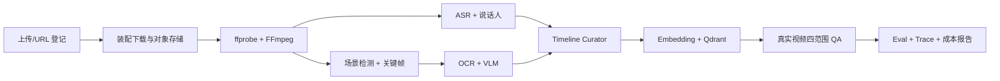

# LetsGoVideoAgent P0 状态

> 核对日期：2026-07-31  
> 结论：**P0 Foundation 的可运行垂直切片已经建立；完整真实视频处理 P0 尚未完成。**

## 1. 当前可以演示什么

在不下载第三方视频、不调用付费模型的情况下，当前仓库可以演示：

1. 启动 FastAPI 和 Next.js。
2. 自动载入一个项目自制的合成塔防教程视频记录和多轨时间轴。
3. 在工作台查看章节、字幕、OCR、视觉事件和合成证据图。
4. 对全视频、当前章节、某一时刻或当前帧提问。
5. QA Investigator 检索证据，Evidence Verifier 核验引用。
6. 返回带时间戳、截图链接、置信度、限制、工具次数、成本字段和 Trace ID 的回答。
7. 查看 Agent Run 的公开步骤与停止原因。
8. 上传本地视频，或登记公开 URL 与权利确认状态。

上传或 URL 登记之后，真实媒体不会自动完成 ASR/OCR/VLM；界面会明确显示“等待 Worker”，而不是伪装成已处理完成。

## 2. 后端状态

| 能力 | 状态 | 说明 |
| --- | --- | --- |
| `src` 布局、领域/Application/Infrastructure 分层 | ✅ | 依赖方向清晰 |
| Video、Timeline、Evidence、Question、Answer、AgentRun 模型 | ✅ | Pydantic 领域模型 |
| FastAPI 健康、视频、导入、上传、时间轴、问答、Run API | ✅ | 有集成测试 |
| InMemoryStore | ✅ | 默认开发与测试后端 |
| MySQL 8.4 Store | ✅ 适配器 | 可选仓库实现；仍需真实容器集成验证和迁移基线 |
| 本地上传存储 | ✅ | 扩展名、大小、随机对象键、SHA-256 |
| URL 基础 SSRF 策略 | ✅ 部分 | 字符串/字面地址检查；下载连接级检查未完成 |
| QA LangGraph | ✅ | 调查 → 核验 → 最多补查一次 |
| Agent Harness | ✅ | 预算、白名单、校验、超时、循环保护、Trace |
| Processing Planner | ✅ 未装配 | 三档计划与视觉调用估算 |
| Timeline Curator | ✅ 回退实现 | 一分钟桶回退；真实语义融合未接入 |
| Qdrant 向量适配器 | 🟡 | 向量契约/安全单测；未装配，未生成 embedding |
| MinIO/S3 对象适配器 | 🟡 | object key 安全单测；上传仍使用本地目录 |
| Redis 缓存/幂等租约 | 🟡 | 适配器已提供；未装配 |
| LiteLLM 模型网关 | 🟡 | 适配器已提供；QA 仍使用 Mock Composer |
| ffprobe/FFmpeg 适配器 | 🟡 | 安全参数/Runner 边界已提供；上传后未自动触发 |
| yt-dlp 元数据/授权下载适配器 | 🟡 | 不自动下载 B 站；未装配到 VideoService |
| Temporal Workflow/Worker 入口 | 🟡 | probe/音轨提取骨架已提供；未装配 API，其余媒体活动未完成 |
| ASR | ⏳ | 未实现 |
| 说话人分离 | ⏳ | 未实现 |
| OCR | ⏳ | 未实现 |
| VLM 画面理解 | ⏳ | 未实现 |
| 场景检测/关键帧去重 | ⏳ | 未实现 |
| OpenTelemetry/Langfuse 导出 | 🧩 | 依赖和配置预留，未贯通 |

## 3. 前端状态

| 能力 | 状态 | 说明 |
| --- | --- | --- |
| Next.js + React + TypeScript | ✅ | 前后端分离 |
| 视频库与状态 | ✅ | 从 API 读取 |
| URL 导入与权利确认 | ✅ | 未确认时仅登记 URL；元数据抓取等待 Worker |
| 本地文件上传 | ✅ | 调用上传 API |
| 多轨时间轴 | ✅ | 支持点击跳转 |
| 四种提问范围 | ✅ | 全视频/章节/时刻/当前帧 |
| 证据卡片 | ✅ | 时间戳、截图和跳转 |
| 回答限制、用量、成本、Trace ID | ✅ | 显示在回答底部 |
| 合成视频交互播放器 | ✅ | 用于无版权 E2E |
| 真实视频流式播放 | ⏳ | 文件只存储，尚无转码/签名播放 URL |
| SSE/WebSocket 流式回答 | ⏳ | 当前为普通 HTTP 请求 |
| 独立 Eval/Trace/成本页面 | ⏳ | 顶栏入口当前禁用 |
| 多会话历史与持久化 UI | ⏳ | API 有 conversation_id，UI 未管理历史 |

## 4. Agent 技术状态

| 技术名词 | 本项目的真实落地 |
| --- | --- |
| Multi-Agent | 四个角色已有代码；当前 QA 路径实际运行 Investigator + Verifier |
| Agent Harness | 已实现为框架无关的统一运行护栏 |
| LangGraph | 已用于 QA 状态图和一次受控修复路由 |
| ReAct | 使用“检索观察 → 回答行动 → 核验/补查”的有界形式 |
| Agentic RAG | 已有时间轴/帧工具和证据核验；当前不是向量语义 RAG |
| AutoGPT | 未引入；不使用无限自治循环 |
| CrewAI | 未引入；角色协作由 LangGraph + Harness 表达 |
| Spec Coding | `specs/001-p0-foundation` 提供需求、计划、任务与验收闭环 |
| Knowledge Base | 单视频时间轴领域模型已建立；跨视频知识库为 P1 |
| MCP | 仅预留工具边界；当前没有对外 MCP Server |
| Application Skill | 只有协议草案，运行时 Loader/Registry 未实现 |

## 5. 数据库和基础设施

| 组件 | P0 定位 | 当前结论 |
| --- | --- | --- |
| MySQL 8.4 | 权威事实库 | Repository 已实现；生产迁移与容器 E2E 待验证 |
| MinIO | 原视频和派生媒体 | 对象适配器/Compose 提供，主应用未装配 |
| Qdrant | 可重建向量索引 | 适配器/Compose 提供，embedding 链路未实现 |
| Redis | 缓存、幂等、短租约 | 适配器/Compose 提供，主应用未装配 |
| Temporal | 长任务可靠编排 | Workflow/Worker/Compose 提供，真实活动未贯通 |

Docker Compose 会编排上述服务、迁移、API、Worker 和前端；当前完成的是配置与构建级验证，不声明已在本机启动整套服务完成视频 E2E。

## 6. 评测状态

已完成：

- 自制合成视频时间轴，覆盖章节、字幕、OCR、视觉和事件。
- global/range/moment/frame API 集成测试。
- Agent 工具越权、预算与重复循环单测。
- B 站明日方舟攻略、教程、Vlog 三类公开 URL 清单。
- 第三方测试集默认 `metadata_only`、不进 CI、不提交视频和截图。
- 人工抓取脚本要求显式 `--acknowledge-rights`。

尚未完成：

- 对 B 站样本的人工授权下载和金标标注。
- ASR WER、说话人 DER、OCR、分段 IoU/边界误差、视频 QA 引用准确率评测。
- 真实模型质量/成本/延迟对比。
- Prompt Injection、恶意媒体和 SSRF 攻击集。

## 7. DevOps 状态

仓库提供或计划在本轮集成：

- 后端和前端多阶段 Dockerfile。
- 全栈 Docker Compose。
- `.dockerignore`。
- Taskfile 常用命令。
- GitHub Actions：后端 lint/type/test、前端 lint/type/test/build、Compose 静态校验、双镜像 build。

边界：

- CI 不下载 B 站或其他第三方媒体。
- CI 不调用真实付费模型。
- 当前 CI 主要验证合成夹具、接口、类型和构建，不等同于生产压测。
- Docker Compose 尚未完成真实运行时 E2E 声明。

## 8. P0 剩余关键路径

优先级：

1. 把已有媒体、对象存储和 Temporal 适配器装配到 Bootstrap。
2. 先接一个本地 ASR 和一个 OCR，形成低成本基线。
3. 实现场景检测、关键帧与真实帧截图。
4. 接 LiteLLM 文本/VLM Provider，并让真实用量进入 Harness。
5. 生成 Qdrant embedding，替换轻量字符匹配。
6. 用自制/授权视频完成真实 E2E，再运行 B 站人工集成评测。
7. 加入语义 Verifier、可观测性和成本聚合。

## 9. 发布判断

| 目标 | 当前是否满足 |
| --- | --- |
| 面试演示“专业 Agent 架构与证据问答闭环” | 是 |
| 演示前后端、Harness、LangGraph、MySQL 适配、测试规范 | 是 |
| 对任意本地真实视频自动生成字幕/OCR/画面章节 | 否 |
| 对 B 站链接自动下载并完成理解 | 否 |
| 公网多租户生产部署 | 否 |

下一次对外版本说明应使用“P0 Foundation / 可运行架构垂直切片”，直到真实媒体流水线通过验收后，才改为“P0 完整版”。

## 10. 关联文档

- [系统架构](../architecture/system-overview.md)
- [Agent Harness](../architecture/agent-harness.md)
- [威胁模型](../security/threat-model.md)
- [成本模型](../cost/cost-model.md)
- [P0 Foundation Spec](../../specs/001-p0-foundation/spec.md)
- [验收清单](../../specs/001-p0-foundation/acceptance.md)
