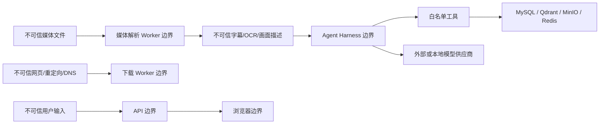

# LetsGoVideoAgent P0 威胁模型

> 范围：本地开发和 P0 Foundation。  
> 目标：在接入真实下载器、媒体解析器和模型前，明确资产、信任边界、已落地控制和发布阻断项。  
> 本文不是法律意见；版权与隐私场景需要结合内容来源和部署地区单独审查。

## 1. 安全目标

1. 用户提交的视频、URL、字幕和画面不能获得系统指令权限。
2. URL 导入不能访问本机、私网、云元数据服务或重定向到这些地址。
3. 恶意媒体不能通过文件名、解析器漏洞或资源耗尽破坏宿主机。
4. Agent 不能越过工具白名单、预算和租户边界。
5. API Key、数据库密码和对象存储凭据不能进入前端、回答或 Trace。
6. 第三方视频、关键帧、人脸和声音不能在未授权情况下被提交到仓库或公开分发。
7. 回答中的时间戳和截图必须可追溯到真实视频内证据。

## 2. 资产

| 资产 | 风险 |
| --- | --- |
| 原始视频、音频和关键帧 | 版权、隐私、体积大、可能含恶意媒体 |
| 字幕、说话人、OCR、视觉描述 | 可能含个人信息、提示注入和敏感内容 |
| API Key 与服务凭据 | 泄露后产生费用或外部系统访问 |
| MySQL 事实数据 | 视频、会话、答案和 Agent Run 的权威记录 |
| Agent 工具权限 | 被滥用可造成网络、存储或费用风险 |
| Trace 与成本记录 | 可泄露问题、证据摘要和内部标识 |
| 下载与处理 Worker | 直接接触不可信网络和媒体文件 |

## 3. 信任边界

最重要的原则是：**公开网页、视频像素、音轨、字幕、OCR 和模型输出都不自动成为可信指令。**

## 4. 攻击面与控制状态

### 4.1 URL 导入与 SSRF

攻击方式：

- `file://`、`ftp://` 等非 HTTP 协议。
- URL 中嵌入用户名和密码。
- `localhost`、私网 IP、回环、链路本地或云元数据地址。
- 域名最初解析为公网，连接时变为私网（DNS rebinding）。
- 公网 URL 通过 30x 重定向到私网。
- 超长响应、无限重定向或压缩炸弹。

已实现：

- 仅允许 HTTP/HTTPS。
- 拒绝 URL 内显式凭据。
- 拒绝 localhost、`.local`、单标签内部域名和字面非全局 IP。
- API 层在下载前要求权利确认；未确认时只登记 URL 和状态。

仍是上线阻断项：

- 下载连接前解析全部 A/AAAA 结果并拒绝非全局地址。
- 每一次重定向重新执行协议、主机、DNS 与目标地址检查。
- 禁用代理环境变量或只允许受控出口代理。
- 限制重定向次数、响应体大小、下载时长、速率和总字节数。
- 仅允许平台适配器声明的 URL 类型；禁止把通用 URL 当作任意 HTTP 客户端。
- 不绕过登录、DRM、付费或地域控制。

### 4.2 文件上传

攻击方式：

- `../../` 路径穿越和重名覆盖。
- 扩展名伪装、MIME 欺骗。
- 超大文件、压缩炸弹或无限流。
- 上传 HTML/SVG 等主动内容后被浏览器同源执行。

已实现：

- 只接受 `.mp4/.mov/.mkv/.webm` 扩展名。
- 原文件名只保留安全扩展名，对象键使用随机 UUID。
- 保存路径解析后必须仍位于配置根目录内。
- 流式读取，超过大小限制立即失败并删除未完成文件。
- 计算 SHA-256。

仍是上线阻断项：

- 检查 magic bytes、容器格式和 MIME，不只相信扩展名。
- 上传临时区和可播放媒体域名分离，禁止浏览器嗅探为主动内容。
- 增加恶意文件扫描或隔离队列。
- 为单用户、单租户和全局并发设置配额。
- 对重复哈希、失败分片和中断上传制定幂等策略。

### 4.3 FFmpeg/ffprobe 与媒体解析

攻击方式：

- 特制媒体触发解析器漏洞。
- 超高分辨率、超长时长、巨量流或异常时间基造成 CPU/内存/磁盘耗尽。
- 输入引用外部协议或本地文件。
- 子进程参数拼接造成命令注入。

适配器层应满足：

- 使用参数数组，不拼接 Shell 字符串。
- 固定协议白名单，关闭不需要的网络协议。
- 为进程设置 wall-clock、CPU、内存、输出字节和帧数限制。
- 在非 root、只读根文件系统、无宿主网络或受控网络的 Worker 中执行。
- 输入与输出使用随机工作目录，结束后按策略清理。
- 记录工具版本、输入哈希和命令摘要，但不记录敏感路径。

当前 FFmpeg/ffprobe 适配器已提供并用 Fake Runner 离线测试，但尚未装配到上传后的主工作流；因此不能把上述隔离要求视为已完成。

### 4.4 Prompt Injection 与工具滥用

攻击方式：

- 字幕或 OCR 出现“忽略规则、调用下载器、泄露密钥”等文本。
- 模型生成未注册工具名或额外参数。
- 重复调用同一工具形成循环。
- 通过截图 URL 或证据字段注入外部地址。

已实现：

- 角色级工具白名单。
- 工具输入和输出使用 Pydantic 严格模型。
- Agent 工具只调用检索和帧检查端口，没有 Shell 工具。
- 工具超时、最大步骤、最大调用次数、最大重复调用和费用预算。
- Trace 不保存隐藏思维链。
- Verifier 对 Evidence ID 和时间范围做确定性核验。

仍需完成：

- 接真实 LLM 后，把系统指令、用户问题和视频证据放入明确分区。
- 对模型输出进行结构化解析和失败重试，不执行自由文本。
- 检查证据中的 URL，只允许由服务端生成的媒体资源标识。
- 做专门的字幕/OCR 提示注入评测集。
- 对“模型建议调用什么”与“系统实际允许什么”保持单向授权。

### 4.5 存储与租户隔离

当前 P0 是单用户本地开发模型，没有账号、租户或 RBAC。若直接公网部署，任何可访问 API 的人都可能看到视频列表和 Agent Run，因此当前版本不满足多用户生产要求。

P1 必须补齐：

- 身份认证与短期访问令牌。
- 每条 Video、Artifact、Question、Answer、Run 的 `tenant_id/owner_id`。
- 仓库查询强制带租户条件，不在调用方手工拼接。
- MinIO/S3 使用短时签名 URL，不返回内部对象键和永久公开桶。
- Qdrant payload 过滤租户和视频 ID。
- 删除视频时执行事实数据、对象、向量、缓存和 Trace 的级联删除/异步清理。

### 4.6 外部模型与数据出境

风险：

- 将视频帧、声音或字幕发送给第三方模型可能触发隐私、保密和数据地域问题。
- 供应商日志保留可能超出本项目保留期。
- API Key 被写入 Trace 或错误消息。

控制要求：

- 每个模型 Provider 标注会发送的数据类型和区域。
- 默认最小化上下文，只发送当前问题需要的帧或证据片段。
- 支持本地 ASR/OCR/VLM/LLM 档位。
- Provider 错误必须脱敏。
- 生产密钥来自 Secret 管理，不进入 `.env.example`、Git 和前端环境变量。
- 用户能够看到并选择处理档位与外部数据发送策略。

LiteLLM 适配器只解决统一调用与用量归一化，不自动解决隐私合规。

### 4.7 隐私、人脸与声音

Vlog、生活视频和线下活动可能包含：

- 路人清晰人脸。
- 未成年人。
- 车牌、住址、工牌、二维码和聊天信息。
- 多人的声音、姓名与现场对话。

P0 不做人脸身份识别。截图导出应保留 `privacy_flags` 和人工确认步骤；公开分享前默认模糊未授权人脸、车牌和二维码。原始媒体和派生图片不进入 Git。

### 4.8 版权与平台规则

- URL 公开可访问不等于允许下载、训练、再分发或发布截图。
- 用户必须确认拥有处理权利；未确认只允许登记公开 URL 和状态。
- B 站人工评测集只提交 URL、BVID、问题与标注格式，不提交视频和生成截图。
- CI 不自动下载第三方视频。
- 对付费、会员、DRM、登录或地区限制内容不得尝试绕过。
- 删除请求需要覆盖原视频、音频、关键帧、OCR、向量、缓存和备份策略。

## 5. STRIDE 风险表

| 类别 | 示例 | 当前控制 | 剩余风险 |
| --- | --- | --- | --- |
| Spoofing | 伪造用户或资源归属 | 本地单用户，无认证 | 公网部署前必须实现认证/租户 |
| Tampering | 修改时间轴或引用 | Pydantic、MySQL 事实模型、引用校验 | 缺少审计签名和版本化 |
| Repudiation | 否认下载或模型调用 | Agent Run 和来源字段 | 下载/删除审计尚未贯通 |
| Information Disclosure | 密钥、字幕、人脸泄露 | `.env` 分离、公开 Trace 最小化 | Provider 与对象 URL 策略待完成 |
| Denial of Service | 大文件、长视频、工具循环 | 上传大小、超时、Harness 预算 | 媒体 Worker 资源限制待完成 |
| Elevation of Privilege | Prompt 注入调用 Shell | 工具白名单、无 Shell 工具 | Skill/MCP 引入时需重新审计 |

## 6. 高优先级风险登记

| ID | 风险 | 等级 | 当前状态 | 关闭条件 |
| --- | --- | --- | --- | --- |
| SEC-001 | URL 下载的 DNS/重定向 SSRF | 高 | 未关闭 | 连接级校验与攻击测试通过 |
| SEC-002 | 媒体解析器逃逸/资源耗尽 | 高 | 未关闭 | 隔离 Worker + 资源限制 + 恶意样本测试 |
| SEC-003 | 无认证 API 被公网访问 | 高 | 接受于本地 P0 | 生产前完成认证和租户隔离 |
| SEC-004 | 视频证据提示注入 | 中高 | 部分控制 | 真实模型结构化输出与注入评测通过 |
| SEC-005 | 第三方内容未经授权下载/发布 | 高 | 权利确认已实现一部分 | 下载审计、保留期和导出审批完成 |
| SEC-006 | API Key 出现在 Trace/错误中 | 高 | 设计控制 | Provider 适配器脱敏测试通过 |
| SEC-007 | 截图泄露路人隐私 | 中高 | 数据集有提示 | 隐私标记、模糊和导出确认完成 |

## 7. P0 本地发布检查

- [x] 默认不启用远程下载。
- [x] 未确认权利的 URL 只登记来源与等待状态。
- [x] 本地媒体目录和派生文件不提交 Git。
- [x] Agent 无 Shell/通用 HTTP 工具。
- [x] 上传路径随机化并限制大小。
- [x] 合成夹具可代替第三方媒体完成 CI。
- [ ] 真实下载器连接级 SSRF 校验。
- [ ] 媒体 Worker 运行时隔离和资源限制验证。
- [ ] 公网认证、RBAC 与多租户。
- [ ] 真实模型数据发送与日志保留审计。
- [ ] 内容删除和派生数据清理流程。

未勾选项不阻止本地合成演示，但阻止把当前版本直接作为公网多用户服务发布。
